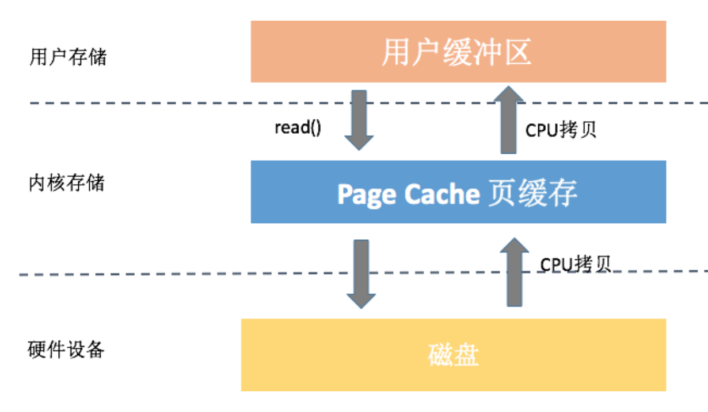
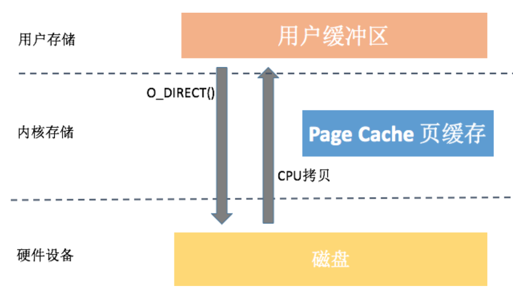
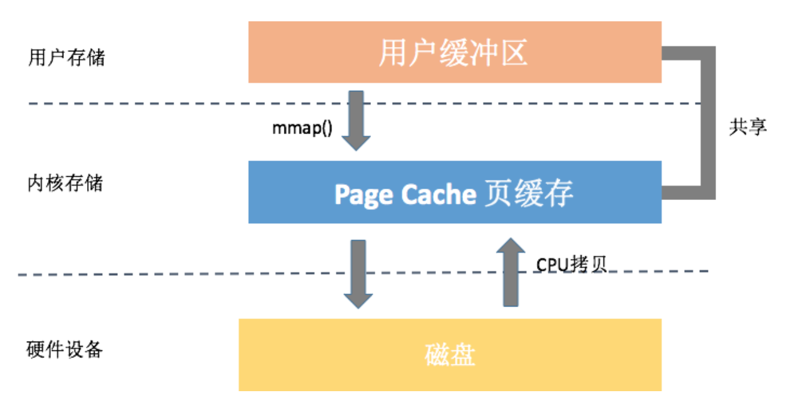

# IO

- [I/O优化（中）：不同I/O方式的使用场景是什么？](https://time.geekbang.org/column/article/75760)
- [Android 高性能日志写入方案](https://www.jianshu.com/p/c4df451673e0)
- [Android中mmap原理及应用简析](https://www.jianshu.com/p/71c9b73d788e)
- [深度分析mmap：是什么 为什么 怎么用 性能总结](https://blog.csdn.net/qq_33611327/article/details/81738195)

## IO的三种方式

-   

## 标准io



-   对于读操作来说，当应用程序读取某块数据的时候，如果这块数据已经存放在页缓存中，那么这块数据就可以立即返回给应用程序，而不需要经过实际的物理读盘操作。
-   ****对于写操作来说，应用程序也会将数据先写到页缓存中去，数据是否被立即写到磁盘上去取决于应用程序所采用写操作的机制**。默认系统采用的是延迟写机制，应用程序只需要将数据写到页缓存中去就可以了，完全不需要等数据全部被写回到磁盘，系统会负责定期地将放在页缓存中的数据刷到磁盘上
-   缓存 I/O 可以很大程度减少真正读写磁盘的次数，从而提升性能。但延迟写机制可能会导致数据丢失，Page Cache 中被修改的内存称为“脏页”，内核通过 flush 线程定期将数据写入磁盘
-   **在实际应用中，如果某些数据我们觉得非常重要，是完全不允许有丢失风险的，这个时候我们应该采用同步写机制。在应用程序中使用 sync、fsync、msync 等系统调用时，内核都会立刻将相应的数据写回到磁盘**

```java
final ParcelFileDescriptor pdf = context.getContentResolver().openFileDescriptor(uri, "rw");
pdf.getFileDescriptor().sync();
```

## 直接io



## mmap



-   通过把文件映射到进程的地址空间，最终映射的物理内存依然在页缓存中
-   mmap是一种内存映射文件的方法，即将一个文件或者其它对象映射到进程的地址空间，实现文件磁盘地址和进程虚拟地址空间中一段虚拟地址的一一对映关系。实现这样的映射关系后，进程就可以采用指针的方式读写操作这一段内存，而系统会自动回写脏页面到对应的文件磁盘上，即完成了对文件的操作而不必再调用read,write等系统调用函数。相反，内核空间对这段区域的修改也直接反映用户空间，从而可以实现不同进程间的文件共享。
-   mmap 比较适合于对同一块区域频繁读写的情况，推荐也使用线程来操作。**用户日志、数据上报都满足这种场景，另外需要跨进程同步的时候，mmap 也是一个不错的选择。Android 跨进程通信有自己独有的 Binder 机制，它内部也是使用 mmap 实现** 

### 优点

-   **减少系统调用**。我们只需要一次 mmap() 系统调用，后续所有的调用像操作内存一样，而不会出现大量的 read/write 系统调用。
-   **减少数据拷贝**。普通的 read() 调用，数据需要经过两次拷贝；而 mmap 只需要从磁盘拷贝一次就可以了，并且由于做过内存映射，也不需要再拷贝回用户空间。
-   **可靠性高**。mmap 把数据写入页缓存后，跟缓存 I/O 的延迟写机制一样，可以依靠内核线程定期写回磁盘。但是需要提的是，mmap 在内核崩溃、突然断电的情况下也一样有可能引起内容丢失，当然我们也可以使用 msync 来强制同步写

### 缺点

-   **虚拟内存增大**。mmap 会导致虚拟内存增大，我们的 APK、Dex、so 都是通过 mmap 读取。而目前大部分的应用还没支持 64 位，除去内核使用的地址空间，一般我们可以使用的虚拟内存空间只有 3GB 左右。如果 mmap 一个 1GB 的文件，应用很容易会出现虚拟内存不足所导致的 OOM。
-   **磁盘延迟**。mmap 通过缺页中断向磁盘发起真正的磁盘 I/O，所以**如果我们当前的问题是在于磁盘 I/O 的高延迟，那么用 mmap() 消除小小的系统调用开销是杯水车薪的**。启动优化中讲到的类重排技术，就是将 Dex 中的类按照启动顺序重新排列，主要为了减少缺页中断造成的磁盘 I/O 延迟
