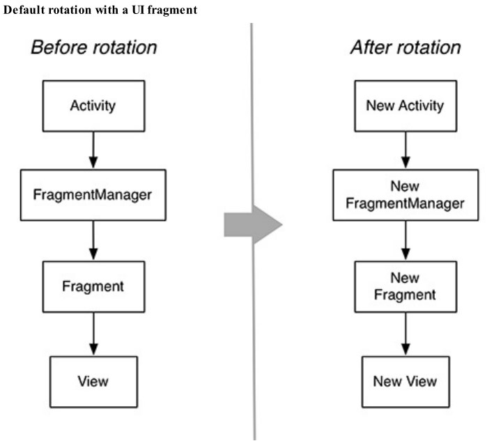
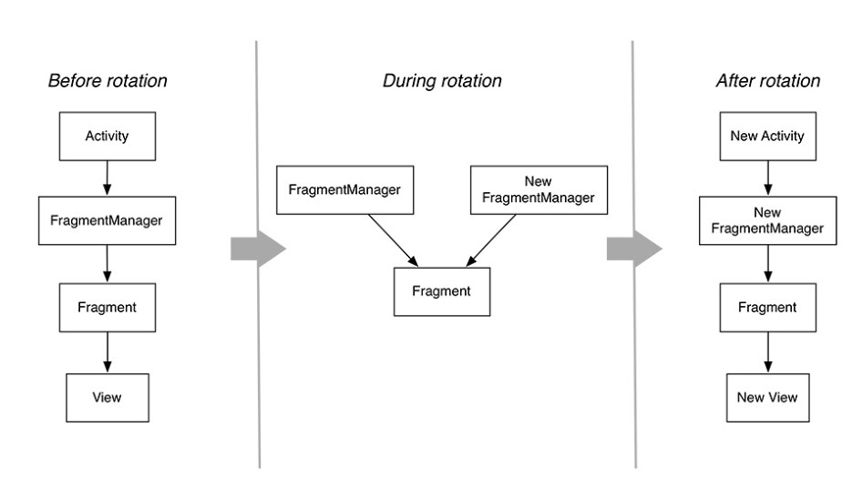

# Fragment

- 可以通过fragment所在的container 的id来唯一标识这一fragment
- FragmentTransaction的commit方法一定要在activity保存状态之前调用。如果想要在保存状态之后调用，使用commitAllowingStateLoss().

## fragment的生命周期


- fragment生命周期与activity生命周期类似，其中最大的不同在于activity的生命周期函数由os调用，而fragment的生命周期函数由fragmentmanager调用。
- fragment的onResume和onPause方法是和activity对应起来的，只有当activity 的onResume和onPause被调用的时候，才会调用对应的fragment的onResume和onPause
- **当调用fragmentTransaction的show()和hide()方法时，是不会再次调用onResume和onPause
- 可以重载onHiddenChanged(boolean)方法，在fragment可见性发生变化时，会回调此函数，其中true时表示隐藏，fragment不可见，false表示不隐藏,fragment可见
- 当ViewPager与fragment联合使用时，可以通过重载setUserVisibleHint来判断fragment是否可见
- 当将fragment add 到fragmentmanager时，首先onAttach(Activity)，onCreate(Bundle)，和onCreateView()会被调用，而onActivityCreated(…)会在宿主activity的onCreate（）被调用后调用
- 将fragment添加到已经处于stopped,paused，running状态的activity时，fragment会快速调用其生命周期函数，从而保持与activity的生命周期相同步
 比如将一个fragment添加到一个处于running状态的activity,fragment会快速的执行onAttach(Activity)，onCreate(Bundle)等生命周期函数，从而与Activity生命周期同步

## fragment的回退栈

- 将一个事务添加到回退栈，点击back键,即使使用replace方法，上一个fragment也不会销毁，而是会回到上一个fragment
- 一般最底层的fragment不会添加到回退栈中，而是直接退出activity

```java
FragmentTwo fTwo = new FragmentTwo();
FragmentManager fm = getFragmentManager();
FragmentTransaction tx = fm.beginTransaction();
tx.replace(R.id.id_content, fTwo, "TWO");
tx.addToBackStack(null);
tx.commit();
```

## fragment与activity

- 如果要给一个activity添加一个没有UI的fragment,使用add(Fragment, tag)
- FragmentTranscton()执行commit后，并不一定是立即执行，它会将事务加入主线程的消息队列中，如果要立即执行transaction的话，可以在主线程调用executePendingTransactions()

### Fragment动画

- 都是调用FragmentTransaction对应的方法

#### 标准转场动画

- 对于执行的每一个transaction,都可以指定一个标准转场动画，setTransition(int transit)
- 该方法可传入的三个参数是：
　　TRANSIT_NONE,
　　TRANSIT_FRAGMENT_OPEN,
　　TRANSIT_FRAGMENT_CLOSE，
   TRANSIT_FRAGMENT_FADE
- 分别对应无动画、打开形式的动画和关闭形式的动画和渐进动画
- 标准动画设置好后，在Fragment添加和移除的时候都会有。

#### v4.Fragment

- 使用的是View动画

```java
public abstract FragmentTransaction setCustomAnimations(@AnimRes int enter,@AnimRes int exit);

public abstract FragmentTransaction setCustomAnimations(@AnimRes int enter,@AnimRes int exit, 
	@AnimRes int popEnter, @AnimRes int popExit);
```

- 如果Activity中包含自己管理的Fragment的引用，可以通过引用直接访问所有的Fragment的public方法
- 如果Activity中未保存任何Fragment的引用,可以通过getFragmentManager.findFragmentByTag()或者findFragmentById()获得任何Fragment实例，然后进行操作
- 通常fragment之间可能会需要交互，比如基于用户事件改变fragment的内容。所有fragment之间的交互需要通过他们关联的activity，两个fragment之间不应该直接交互

#### Fragment

- 使用的是属性动画

```java
 public abstract FragmentTransaction setCustomAnimations(@AnimatorRes int enter,@AnimatorRes int exit);

 public abstract FragmentTransaction setCustomAnimations(@AnimatorRes int enter,@AnimatorRes int exit, 
 	@AnimatorRes int popEnter, @AnimatorRes int popExit);
```

- 为了让fragment与activity交互，可以在Fragment 类中定义一个接口，并在activity中实现。

```java
public class HeadlinesFragment extends ListFragment {
    OnHeadlineSelectedListener mCallback;
    public interface OnHeadlineSelectedListener {
        public void onArticleSelected(int position);
    }

    @Override
    public void onAttach(Activity activity) {
        super.onAttach(activity);
        try {
            mCallback = (OnHeadlineSelectedListener) activity;
        } catch (ClassCastException e) {
            throw new ClassCastException(activity.toString() + " must implement OnHeadlineSelectedListener");
        }
    }
}
```

- activity向fragment传递参数，用setArguments,setArguments方法必须在fragment创建以后，add到activity前完成。千万不要，首先调用了add，然后设置arguments。
- fragment添加到activity,首先查找fragment是否已经存在，不存在则new 出新实例

```java
public class MainActivity extends FragmentActivity
{
    private ContentFragment mContentFragment;

    @Override
    protected void onCreate(Bundle savedInstanceState)
    {
        super.onCreate(savedInstanceState);
        setContentView(R.layout.activity_main);
        FragmentManager fm = getSupportFragmentManager();
        mContentFragment = (ContentFragment) fm.findFragmentById(R.id.id_fragment_container);
        if(mContentFragment == null )
        {
            mContentFragment = new ContentFragment();
            fm.beginTransaction().add(R.id.id_fragment_container,mContentFragment).commit();
        }
    }
}
```

- Fragment中存在startActivityForResult（）以及onActivityResult（）方法，但是fragment没有setResult（）方法，用于设置返回的intent，需要通过调用getActivity().setResult(XXFragment.REQUEST_CODE, intent);

- 对于属于同一个activity的两个fragment之间的交互，除了可以用activity作为桥梁来交互，还可以用setTargetFragment

```java
public class ContentFragment extends Fragment
{
 
	private String mArgument;
	public static final String ARGUMENT = "argument";
	public static final String RESPONSE = "response";
	public static final String EVALUATE_DIALOG = "evaluate_dialog";
	public static final int REQUEST_EVALUATE = 0X110;
 
	//...
 
	@Override
	public View onCreateView(LayoutInflater inflater, ViewGroup container,
			Bundle savedInstanceState)
	{
		Random random = new Random();
		TextView tv = new TextView(getActivity());
		ViewGroup.LayoutParams params = new ViewGroup.LayoutParams(
				LayoutParams.MATCH_PARENT, LayoutParams.MATCH_PARENT);
		tv.setLayoutParams(params);
		tv.setText(mArgument);
		tv.setGravity(Gravity.CENTER);
		tv.setBackgroundColor(Color.argb(random.nextInt(100),
				random.nextInt(255), random.nextInt(255), random.nextInt(255)));
		// set click
		tv.setOnClickListener(new OnClickListener()
		{
 
			@Override
			public void onClick(View v)
			{
				EvaluateDialog dialog = new EvaluateDialog();
				//注意setTargetFragment
				dialog.setTargetFragment(ContentFragment.this, REQUEST_EVALUATE);
				dialog.show(getFragmentManager(), EVALUATE_DIALOG);
			}
		});
		return tv;
	}
 
	//接收返回回来的数据
	@Override
	public void onActivityResult(int requestCode, int resultCode, Intent data)
	{
		super.onActivityResult(requestCode, resultCode, data);
 
		if (requestCode == REQUEST_EVALUATE)
		{
			String evaluate = data.getStringExtra(EvaluateDialog.RESPONSE_EVALUATE);
			Toast.makeText(getActivity(), evaluate, Toast.LENGTH_SHORT).show();
			Intent intent = new Intent();
			intent.putExtra(RESPONSE, evaluate);
			getActivity().setResult(Activity.REQUEST_OK, intent);
		}
	}
}
```

```java
package com.example.demo_zhy_23_fragments;
 
import android.app.Activity;
import android.app.AlertDialog;
import android.app.Dialog;
import android.content.DialogInterface;
import android.content.DialogInterface.OnClickListener;
import android.content.Intent;
import android.os.Bundle;
import android.support.v4.app.DialogFragment;
 
public class EvaluateDialog extends DialogFragment
{
	private String[] mEvaluteVals = new String[] { "GOOD", "BAD", "NORMAL" };
	public static final String RESPONSE_EVALUATE = "response_evaluate";
 
	@Override
	public Dialog onCreateDialog(Bundle savedInstanceState)
	{
		AlertDialog.Builder builder = new AlertDialog.Builder(getActivity());
 
		builder.setTitle("Evaluate :").setItems(mEvaluteVals,
				new OnClickListener()
				{
					@Override
					public void onClick(DialogInterface dialog, int which)
					{
						setResult(which);
					}
				});
		return builder.create();
	}
 
	// 设置返回数据
	protected void setResult(int which)
	{
		// 判断是否设置了targetFragment
		if (getTargetFragment() == null)
			return;
 
		Intent intent = new Intent();
		intent.putExtra(RESPONSE_EVALUATE, mEvaluteVals[which]);
		getTargetFragment().onActivityResult(ContentFragment.REQUEST_EVALUATE,Activity.RESULT_OK, intent);
	}
}
```

## fragment之间的交互

fragment A用于展示数据，B用于输入数据，B中数据输入完成更新A的视图
在手机上，由A startActivityForResult（）一个只包含B的activity，然后在onActivityReult（）中获取数据
在大屏上，B fragment一般可以用一个dialogment来实现，并且设置B的targetFragment为A，这样当B中的fragment结束时，用getTargetFragement 的onActivityResult获取数据两者都用到了onActivityResult，从而实现了代码的复用

推荐使用dialogfragment创建对话框，而不是使用dialog

## retain instance

当activity的configration发生变化，比如旋转屏幕后，activity会detroy然后recreate
有些情况却希望保持不变，比如播放视频，保持其中的fragment在activity销毁重建过程中不变，可以使用setRetainInstance(true);
retained的fragment 仅当由于activity的configration发生变化，activity需要destroy然后recreate，如果activity完全被销毁，fragment也会被销毁

```java
private Button mPlayButton;
private Button mStopButton; 

@Override
public void onCreate(Bundle savedInstanceState) {
  super.onCreate(savedInstanceState);
  setRetainInstance(true);
}
```

设置为false时，configration发生变时时



设置为true时，fragment实例没有被destroy，但是其view仍然被销毁了，从原来的activity  detach掉，处理retained状态，新activity创建后，view重新创建，再attach到新的activity上



## setRetainInstance(true)与onSavedInstanceState

想长时间保存的东西，使用onSavedInstanceState，这样当用户长时间离开后，仍然可以恢复，如果使用setRetainedInstance，保存的数据与retained fragment绑定了
旋转的时候，想要传递数据的话，一般采用retainInstance