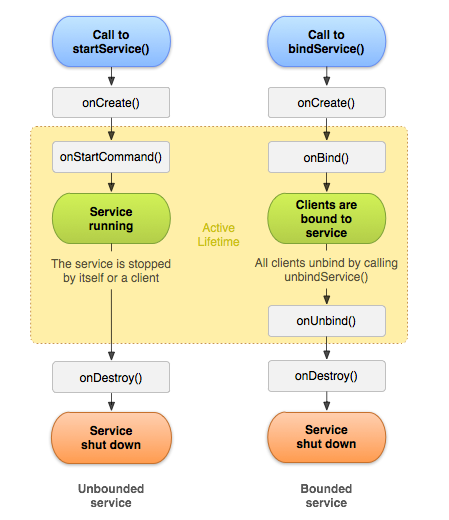
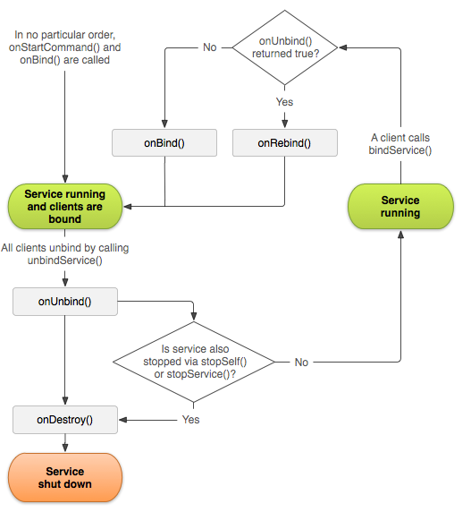

# service

## 生命周期

### startService,stopService

- onCreate()，首次创建服务时，系统将调用此方法来执行一次性设置程序（在调用 onStartCommand() 或 onBind() 之前）。如果服务已在运行，则不会调用此方法
- onStartCommand(), 当通过调用 context.startService() 请求启动服务时，系统将调用此方法。一旦执行此方法，服务即会启动并可在后台无限期运行,
 如果实现此方法，则在服务工作完成后，需要由您通过调用 stopSelf() 或 stopService() 来停止服务.
- onDestroy(),当服务不再使用且将被销毁时，系统将调用此方法。服务应该实现此方法来清理所有资源，如线程、注册的侦听器、接收器等
- 通过startService()启动服务，**onCreate()只会在创建的时候执行一次，但是每次startService都会执行onStartCommand()**
- **通过调用 startService() 启动服务，则服务将一直运行，直到服务使用 stopSelf() 自行停止运行**，或由其他组件通过调用 stopService() 停止它为止。


### bindService，unbindService

- 当应用组件通过调用 bindService() 绑定到服务时，服务即处于“绑定”状态。绑定服务提供了一个客户端-服务器接口
 允许组件与服务进行交互、发送请求、获取结果，甚至是利用进程间通信 (IPC) 跨进程执行这些操作，仅当与另一个应用组件绑定时，
 绑定服务才会运行。 **多个组件可以同时绑定到该服务，但全部取消绑定后，该服务即会被销毁**
- bindService()必须实现 onBind() 回调方法，**该方法返回的 IBinder 对象定义了客户端用来与服务进行交互的编程接口**
- 客户端可通过调用 bindService() 绑定到服务。调用时，它必须提供 ServiceConnection 的实现，后者会监控与服务的连接。bindService() 方法会立即无值返回，
 但当 Android 系统创建客户端与服务之间的连接时，会对 ServiceConnection 调用 onServiceConnected()，向客户端传递用来与服务通信的 IBinder。
 多个客户端可同时连接到一个服务。不过，只有在第一个客户端绑定时，系统才会调用服务的 onBind() 方法来检索 IBinder。系统随后无需再次调用 onBind()，
 便可将同一 IBinder 传递至任何其他绑定的客户端。 **当最后一个客户端取消与服务的绑定时，系统会将服务销毁（除非 startService() 也启动了该服务**


### 具有已启动和绑定两种状态的服务

- 您可以创建同时具有已启动和绑定两种状态的服务。 也就是说，可通过调用 startService() 启动该服务，让服务无限期运行；此外，还可通过调用 bindService() 使客户端绑定到服务。
 **如果您确实允许服务同时具有已启动和绑定状态，则服务启动后，系统“不会”在所有客户端都取消绑定时销毁服务**。 为此，您必须通过调用 stopSelf() 或 stopService() 显式停止服务。
 尽管您通常应该实现 onBind() 或 onStartCommand()，但有时需要同时实现这两者。例如，音乐播放器可能发现让其服务无限期运行并同时提供绑定很有用处。 这样一来
 ，Activity 便可启动服务进行音乐播放，即使用户离开应用，音乐播放也不会停止。 然后，当用户返回应用时，Activity 可绑定到服务，重新获得回放控制权





## 绑定服务

### 扩展Binder类

1.在您的服务中，创建一个可满足下列任一要求的 Binder 实例：

- 包含客户端可调用的公共方法
- 返回当前 Service 实例，其中包含客户端可调用的公共方法
- 或返回由服务承载的其他类的实例，其中包含客户端可调用的公共方法

2.从 onBind() 回调方法返回此 Binder 实例。

3.在客户端中，从 onServiceConnected() 回调方法接收 Binder，并使用提供的方法调用绑定服务。

```java
public class LocalService extends Service {
    // Binder given to clients
    private final IBinder mBinder = new LocalBinder();
    // Random number generator
    private final Random mGenerator = new Random();

    /**
     * Class used for the client Binder.  Because we know this service always
     * runs in the same process as its clients, we don't need to deal with IPC.
     */
    public class LocalBinder extends Binder {
        LocalService getService() {
            // Return this instance of LocalService so clients can call public methods
            return LocalService.this;
        }
    }

    @Override
    public IBinder onBind(Intent intent) {
        return mBinder;
    }

    /** method for clients */
    public int getRandomNumber() {
      return mGenerator.nextInt(100);
    }
}
```

```java
public class BindingActivity extends Activity {
    LocalService mService;
    boolean mBound = false;

    @Override
    protected void onCreate(Bundle savedInstanceState) {
        super.onCreate(savedInstanceState);
        setContentView(R.layout.main);
    }

    @Override
    protected void onStart() {
        super.onStart();
        // Bind to LocalService
        Intent intent = new Intent(this, LocalService.class);
        bindService(intent, mConnection, Context.BIND_AUTO_CREATE);
    }

    @Override
    protected void onStop() {
        super.onStop();
        // Unbind from the service
        if (mBound) {
            unbindService(mConnection);
            mBound = false;
        }
    }

    /** Called when a button is clicked (the button in the layout file attaches to
      * this method with the android:onClick attribute) */
    public void onButtonClick(View v) {
        if (mBound) {
            // Call a method from the LocalService.
            // However, if this call were something that might hang, then this request should
            // occur in a separate thread to avoid slowing down the activity performance.
            int num = mService.getRandomNumber();
            Toast.makeText(this, "number: " + num, Toast.LENGTH_SHORT).show();
        }
    }

    /** Defines callbacks for service binding, passed to bindService() */
    private ServiceConnection mConnection = new ServiceConnection() {

        @Override
        public void onServiceConnected(ComponentName className,
                IBinder service) {
            // We've bound to LocalService, cast the IBinder and get LocalService instance
            LocalBinder binder = (LocalBinder) service;
            mService = binder.getService();
            mBound = true;
        }

        @Override
        public void onServiceDisconnected(ComponentName arg0) {
            mBound = false;
        }
    };
}
```


### 使用messager

1.使用messager的主要目的是为了跨进程

2.使用messager的顺序

- service实现一个 Handler，由其接收来自客户端的每个调用的回调
- Handler 用于创建 Messenger 对象
- Messenger 创建一个 IBinder，service通过 onBind() 使其返回客户端
- 客户端使用 IBinder 将 Messenger（引用service的 Handler）实例化，然后使用后者将 Message 对象发送给服务
- service在其 Handler 中（具体地讲，是在 handleMessage() 方法中）接收每个 Message

```java
public class MessengerService extends Service {
    /** Command to the service to display a message */
    static final int MSG_SAY_HELLO = 1;

    /**
     * Handler of incoming messages from clients.
     * 第一步
     */
    class IncomingHandler extends Handler {
        @Override
        public void handleMessage(Message msg) {
            switch (msg.what) {
                case MSG_SAY_HELLO:
                    Toast.makeText(getApplicationContext(), "hello!", Toast.LENGTH_SHORT).show();
                    break;
                default:
                    super.handleMessage(msg);
            }
        }
    }

    /**
     * Target we publish for clients to send messages to IncomingHandler.
     * 第二步
     */
    final Messenger mMessenger = new Messenger(new IncomingHandler());

    /**
     * When binding to the service, we return an interface to our messenger
     * for sending messages to the service.
     * 第三步
     */
    @Override
    public IBinder onBind(Intent intent) {
        Toast.makeText(getApplicationContext(), "binding", Toast.LENGTH_SHORT).show();
        return mMessenger.getBinder();
    }
}
```

```java
public class ActivityMessenger extends Activity {
    /** Messenger for communicating with the service. */
    Messenger mService = null;

    /** Flag indicating whether we have called bind on the service. */
    boolean mBound;

    /**
     * Class for interacting with the main interface of the service.
     * 第四步
     */
    private ServiceConnection mConnection = new ServiceConnection() {
        public void onServiceConnected(ComponentName className, IBinder service) {
            // This is called when the connection with the service has been
            // established, giving us the object we can use to
            // interact with the service.  We are communicating with the
            // service using a Messenger, so here we get a client-side
            // representation of that from the raw IBinder object.
            mService = new Messenger(service);
            mBound = true;
        }

        public void onServiceDisconnected(ComponentName className) {
            // This is called when the connection with the service has been
            // unexpectedly disconnected -- that is, its process crashed.
            mService = null;
            mBound = false;
        }
    };

    /**
     * Class for interacting with the main interface of the service.
     * 第五步
     */
    public void sayHello(View v) {
        if (!mBound) return;
        // Create and send a message to the service, using a supported 'what' value
        Message msg = Message.obtain(null, MessengerService.MSG_SAY_HELLO, 0, 0);
        try {
            mService.send(msg);
        } catch (RemoteException e) {
            e.printStackTrace();
        }
    }

    @Override
    protected void onCreate(Bundle savedInstanceState) {
        super.onCreate(savedInstanceState);
        setContentView(R.layout.main);
    }

    @Override
    protected void onStart() {
        super.onStart();
        // Bind to the service
        bindService(new Intent(this, MessengerService.class), mConnection,
            Context.BIND_AUTO_CREATE);
    }

    @Override
    protected void onStop() {
        super.onStop();
        // Unbind from the service
        if (mBound) {
            unbindService(mConnection);
            mBound = false;
        }
    }
}
```


### 绑定的其它相关内容

- 如果您只需要**在 Activity 可见时与服务交互，则应在 onStart() 期间绑定，在 onStop() 期间取消绑定**
- 如果您希望 **Activity 在后台停止运行状态下仍可接收响应，则可在 onCreate() 期间绑定，在 onDestroy() 期间取消绑定**
- **切勿在 Activity 的 onResume() 和 onPause() 期间绑定和取消绑定**，因为每一次生命周期转换都会发生这些回调，您应该使发生在
 这些转换期间的处理保持在最低水平。此外，如果您的应用内的多个 Activity 绑定到同一服务，并且其中两个 Activity 之间发生了转换，
 则**如果当前 Activity 在下一个 Activity 绑定（恢复期间）之前取消绑定（暂停期间），系统可能会销毁服务并重建服务**
- 当服务与所有客户端之间的绑定全部取消时，Android 系统便会销毁服务（**除非还使用 onStartCommand() 启动了该服务**），
 因此，如果服务是纯粹的绑定服务，则无需对其生命周期进行管理 — Android 系统会根据它是否绑定到任何客户端代您管理
- 如果您选择实现 onStartCommand() 回调方法，则**必须显式停止服务**，因为系统现在已将服务视为已启动。在此情况下，
 服务将一直运行到其通过 stopSelf() 自行停止，或其他组件调用 stopService() 为止，无论其是否绑定到任何客户端
- 如果您的服务已启动并接受绑定，则当系统调用您的 onUnbind() 方法时，**如果您想在客户端下一次绑定到服务时接收 onRebind() 调用，则可选择返回 true**。
 onRebind() 返回空值，但客户端仍在其 onServiceConnected() 回调中接收 IBinder。


### 具有已启动和绑定两种状态的服务的生命周期




## IntentService

### 特点

- **创建默认的工作线程**，用于在应用的主线程外执行传递给 onStartCommand() 的所有 Intent。
- 创建工作队列，用于将 Intent **逐一传递给 onHandleIntent() 实现**
- 在处理完所有启动请求后停止服务，因此您永远不必调用 stopSelf()。
- 提供 onBind() 的默认实现（返回 null）。
- 提供 onStartCommand() 的默认实现，可将 Intent 依次发送到工作队列和 onHandleIntent() 实现。
- 如果重写其他回调方法（如 onCreate()、onStartCommand() 或 onDestroy()），**必须调用超类实现**，以便 IntentService 能够妥善处理工作线程的生命周期

```java
public class HelloIntentService extends IntentService {

  /**
   * A constructor is required, and must call the super IntentService(String)
   * constructor with a name for the worker thread.
   */
  public HelloIntentService() {
      super("HelloIntentService");
  }

  /**
   * The IntentService calls this method from the default worker thread with
   * the intent that started the service. When this method returns, IntentService
   * stops the service, as appropriate.
   */
  @Override
  protected void onHandleIntent(Intent intent) {
      // Normally we would do some work here, like download a file.
      // For our sample, we just sleep for 5 seconds.
      try {
          Thread.sleep(5000);
      } catch (InterruptedException e) {
          // Restore interrupt status.
          Thread.currentThread().interrupt();
      }
  }
}
```

## onStartCommand

1. onStartCommand() 方法必须返回整型数。整型数是一个值，用于描述系统应该如何在服务终止的情况下继续运行服务。
- START_NOT_STICKY
 如果系统在 onStartCommand() 返回后终止服务，则**除非有挂起 Intent 要传递，否则系统不会重建服务**。这是最安全的选项，
 可以避免在不必要时以及应用能够轻松重启所有未完成的作业时运行服务。

- START_STICKY
 如果系统在 onStartCommand() 返回后终止服务，则会重建服务并调用 onStartCommand()，但不会重新传递最后一个 Intent。
 相反，除非有挂起 Intent 要启动服务（在这种情况下，将传递这些 Intent ），否则系统会通过空Intent 调用 onStartCommand()。
 这适用于不执行命令、但无限期运行并等待作业的媒体播放器（或类似服务）。

- START_REDELIVER_INTENT
 如果系统在 onStartCommand() 返回后终止服务，则会重建服务，并通过传递给服务的最后一个 Intent 调用 onStartCommand()。
 任何挂起 Intent 均依次传递。这适用于主动执行应该立即恢复的作业（例如下载文件）的服务。


## 前台服务

### 前台服务特点

- 前台服务被认为是用户主动意识到的一种服务，因此在内存不足时，系统也不会考虑将其终止。
- 前台服务必须为状态栏提供通知，放在“正在进行”标题下方，这意味着除非服务停止或从前台移除，否则不能清除通知

```java
Notification notification = new Notification(R.drawable.icon, getText(R.string.ticker_text),
        System.currentTimeMillis());
Intent notificationIntent = new Intent(this, ExampleActivity.class);
PendingIntent pendingIntent = PendingIntent.getActivity(this, 0, notificationIntent, 0);
notification.setLatestEventInfo(this, getText(R.string.notification_title),
        getText(R.string.notification_message), pendingIntent);
startForeground(ONGOING_NOTIFICATION_ID, notification);
```
