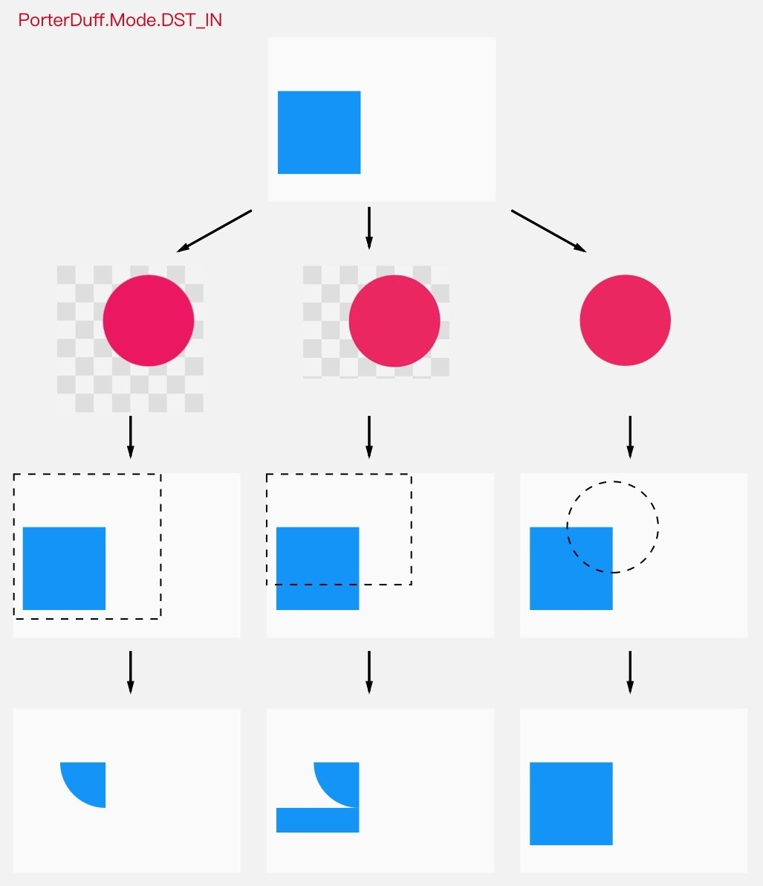
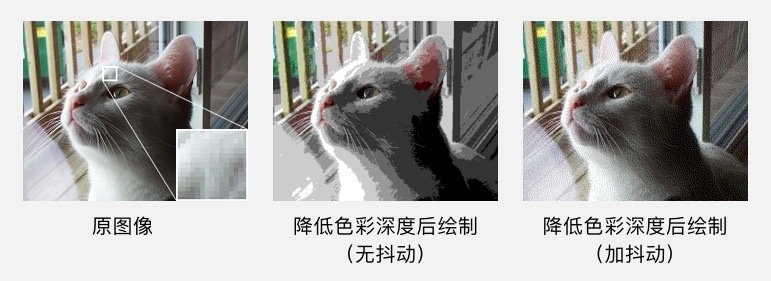

# Paint基础

- [相关资料](#相关资料)
- [颜色相关](#颜色相关)
    - [直接设置颜色](#直接设置颜色)
        - [设置颜色](#设置颜色)
        - [设置Shader](#设置shader)
            - [LinearGradient](#lineargradient)
            - [RadialGradient](#radialgradient)
            - [SweepGradient](#sweepgradient)
            - [BitmapShader](#bitmapshader)
            - [ComposeShader](#composeshader)
    - [setColorFilter(ColorFilter filter)](#setcolorfiltercolorfilter-filter)
        - [LightingColorFilter](#lightingcolorfilter)
        - [PorterDuffColorFilter](#porterduffcolorfilter)
        - [ColorMatrixColorFilter](#colormatrixcolorfilter)
            - [Fresco中的灰度处理](#fresco中的灰度处理)
    - [setXfermode](#setxfermode)
        - [离屏缓冲](#离屏缓冲)
            - [Canvas.saveLayer](#canvassavelayer)
            - [View.setLayerType()](#viewsetlayertype)
        - [控制好透明区域](#控制好透明区域)
- [效果](#效果)
    - [抗锯齿](#抗锯齿)
    - [Paint.Style](#paintstyle)
    - [线条形状](#线条形状)
        - [线条宽](#线条宽)
        - [Paint.Cap](#paintcap)
        - [Paint.Join](#paintjoin)
        - [setStrokeMiter(float miter)](#setstrokemiterfloat-miter)
    - [色彩优化](#色彩优化)
        - [setDither](#setdither)
        - [setFilterBitmap](#setfilterbitmap)
    - [setPathEffect](#setpatheffect)
    - [setShadowLayer](#setshadowlayer)
    - [setMastFilter](#setmastfilter)
- [获取绘制的Path](#获取绘制的path)
- [常用方法](#常用方法)

## 相关资料

- [Paint 详解](http://hencoder.com/ui-1-2/)

## 颜色相关

### 直接设置颜色

#### 设置颜色

```java
public void setColor(@ColorInt int color)

public void setARGB(int a, int r, int g, int b) {
    setColor((a << 24) | (r << 16) | (g << 8) | b);
}
```

#### 设置Shader

- **当设置了Shader后，原先设置的setColor()/setARGB()就不起作用了**
- 使用Shader一般就是使用它的几个子类：LinearGradient,RadialGradient,SweepGradient,BitmapShader,CoposeShader

##### LinearGradient

```java
// (x0,y0) 与(x1,y1)渐变的两个端点
// color0与color1两个端点的颜色
// 着色规则：CLAMP,MIRROR(镜像)，REPEAT(重复)
public LinearGradient(float x0, float y0, float x1, float y1,
    @ColorInt int color0, @ColorInt int color1,
    @NonNull TileMode tile)

// colors[]对应着位置在position[]各个值的颜色
// 其中position中的每一个值都是在(0,1)之间
public LinearGradient(float x0, float y0, float x1, float y1,
    @NonNull @ColorInt int colors[],@Nullable float positions[],
    @NonNull TileMode tile)
```

```java
Shader shader = new LinearGradient(100, 100, 500, 500, Color.parseColor("#E91E63"),  
        Color.parseColor("#2196F3"), Shader.TileMode.CLAMP);
paint.setShader(shader);

// ...
canvas.drawCircle(300, 300, 200, paint);
```

##### RadialGradient

```java
 public RadialGradient(float centerX, float centerY, float radius,
    @NonNull @ColorInt int colors[], @Nullable float stops[],
    @NonNull TileMode tileMode)

 public RadialGradient(float centerX, float centerY, float radius,
    @ColorInt int centerColor, @ColorInt int edgeColor, 
    @NonNull TileMode tileMode)
```

- 与LinearGradient类似，不过是圆形径向变化的

##### SweepGradient

```java
public SweepGradient(float cx, float cy, @ColorInt int color0, @ColorInt int color1)
 public SweepGradient(float cx, float cy,
            @NonNull @ColorInt int colors[], @Nullable float positions[])
```

- 以中心点扇形的渐变


##### BitmapShader

- **就是用Bitmap的像素作为图形或文字的填充**
- **如果想绘制不同形状的bitmap就可以采用这种方法**

```java
public BitmapShader(@NonNull Bitmap bitmap, @NonNull TileMode tileX, @NonNull TileMode tileY)
```

```java
Bitmap bitmap = BitmapFactory.decodeResource(getResources(), R.drawable.batman);
Shader shader = new BitmapShader(bitmap, Shader.TileMode.CLAMP, Shader.TileMode.CLAMP);
paint.setShader(shader);

//...

canvas.drawCircle(300, 300, 200, paint);
```


##### ComposeShader

- **就是将两个shader混合起来一起使用**
- mode使将shaderB绘制在shaderA时的混合模式

```java
public ComposeShader(@NonNull Shader shaderA, @NonNull Shader shaderB,
            @NonNull PorterDuff.Mode mode)
```

```java
// 第一个 Shader：头像的 Bitmap
Bitmap bitmap1 = BitmapFactory.decodeResource(getResources(), R.drawable.batman);
Shader shader1 = new BitmapShader(bitmap1, Shader.TileMode.CLAMP, Shader.TileMode.CLAMP);

// 第二个 Shader：从上到下的线性渐变（由透明到黑色）
Bitmap bitmap2 = BitmapFactory.decodeResource(getResources(), R.drawable.batman_logo);
Shader shader2 = new BitmapShader(bitmap2, Shader.TileMode.CLAMP, Shader.TileMode.CLAMP);

// ComposeShader：结合两个 Shader
Shader shader = new ComposeShader(shader1, shader2, PorterDuff.Mode.SRC_OVER);
paint.setShader(shader);

//...

canvas.drawCircle(300, 300, 300, paint);
```


### setColorFilter(ColorFilter filter)

- 设置颜色过滤器,颜色过滤的意思，就是为绘制的内容设置一个统一的过滤策略，然后 Canvas.drawXXX() 方法会对每个像素都进行过滤后再绘制出来

- ColorFilter有以下几个子类可用: ColorMatrixColorFilter, LightingColorFilter, PorterDuffColorFilter

#### LightingColorFilter

```java
LightingColorFilter (int mul, int add);
```

- mul全称是colorMultiply意为色彩倍增，而add全称是colorAdd意为色彩添加
- 这两个值都是16进制的色彩值0xAARRGGBB。

- 最后生成的颜色计算方法为

```java
R' = R * mul.R / 0xff + add.R
G' = G * mul.G / 0xff + add.G
B' = B * mul.B / 0xff + add.B
```

- **LightingColorFilter(0xFFFFFF, 0x000000)的时候原图是不会有任何改变的**

```java
R' = R * 0xff / 0xff + 0x0 = R // R' = R
G' = G * 0xff / 0xff + 0x0 = G // G' = G
B' = B * 0xff / 0xff + 0x0 = B // B' = B
```

- 如果我们想要**移除红色，可以使用将可以使用LightingColorFilter(0x00FFFF, 0x000000)**

```java
R' = R * 0x0 / 0xff + 0x0 = 0 // 红色被移除
G' = G * 0xff / 0xff + 0x0 = G
B' = B * 0xff / 0xff + 0x0 = B
```

- 如果我们想增加红色的值，那么可以使用LightingColorFilter(0xFFFFFF, 0xXX0000)就好，其中XX取值为00至FF

```java
R' = R * 0xff / 0xff + 0xXX = R + 0xXX （红色被增强）
G' = G * 0xff / 0xff + 0x0 = G
B' = B * 0xff / 0xff + 0x0 = B
```

```java
// 我们想要去掉绿色
@Override
protected void onDraw(Canvas canvas) {
    super.onDraw(canvas);

    // 设置颜色过滤
    mPaint.setColorFilter(new LightingColorFilter(0xFF00FF, 0x000000));

    Bitmap bitmap = BitmapFactory.decodeResource(mContext.getResources(), R.drawable.kale);
    canvas.drawBitmap(bitmap,240,600,mPaint);
}
```

#### PorterDuffColorFilter

```java
PorterDuffColorFilter(int color, PorterDuff.Mode mode)
```

- 这个构造方法也接受两个值，一个是16进制表示的颜色值，而另一个是PorterDuff内部类Mode中的一个常量值，这个值表示混合模式。

- 将画布上的元素和我们设置的color进行混合，产生最终的效果。

```java
@Override
protected void onDraw(Canvas canvas) {
    super.onDraw(canvas);

    // 设置颜色过滤
    mPaint.setColorFilter(new PorterDuffColorFilter(Color.RED, PorterDuff.Mode.DARKEN));

    Bitmap bitmap = BitmapFactory.decodeResource(mContext.getResources(), R.drawable.kale);
    canvas.drawBitmap(bitmap,240,600,mPaint);
}
```

- 但是这里要注意一点，PorterDuff.Mode中的模式不仅仅是应用于图像色彩混合，还应用于图形混合，比如PorterDuff.Mode.DST_OUT就表示裁剪混合图。

#### ColorMatrixColorFilter

[ColorMatrix](http://developer.Android.com/reference/android/graphics/ColorMatrix.html)

- 在Android中，图片是以一个个 RGBA 的像素点的形式加载到内存中的，所以如果需要改变图片的颜色，就需要针对这一个个像素点的RGBA的值进行修改，其实主要是RGB，A是透明度；

- 修改图片 RGBA 的值需要ColorMatrix类的支持，它定义了一个 4*5 的float[]类型的矩阵，矩阵中每一行表示 RGBA 中的一个参数

- 展示的颜色效果取决于图像的RGBA（红色、绿色、蓝色、透明度）值。而图像的 RGBA 值则存储在一个5*1的颜色分量矩阵C中，由颜色分量矩阵C可以控制图像的颜色效果

- 为了改变图像的显示效果，只需要改变 4*5 的颜色矩阵ColorMatrix，然后通过矩阵计算，即可得到新的图像显示矩阵


- 通过颜色矩阵 ColorMatrix 修改了原图像的 RGBA 值，从而达到了改变图片颜色效果的目的。并且，通过如上图所示的运算可知，颜色矩阵 ColorMatrix 的第一行参数abcde决定了图像的红色成分，第二行参数fghij决定了图像的绿色成分，第三行参数klmno决定了图像的蓝色成分，第四行参数pqrst决定了图像的透明度，第五列参数ejot是颜色的偏移量

- 我们利用ColorFilter 和 ColorMatrixColorFilter类和 Paint 的setColorFilter 就可以改变图片的展示效果（颜色，饱和度，对比度等），从而得到类似市面上图像软件中的黑白老照片、泛黄旧照片、羞涩的青春等等特效

##### Fresco中的灰度处理

```java
public class GrayPostprocessor extends BasePostprocessor {

    private static final GrayPostprocessor GRAY_PROCESSOR = new GrayPostprocessor();

    public static GrayPostprocessor get() {
        return GRAY_PROCESSOR;
    }

    private GrayPostprocessor() {
    }

    @Override
    public String getName() {
        return "GrayPostprocessor";
    }

    @Override
    public void process(Bitmap bitmap) {
        Canvas c = new Canvas(bitmap);
        Paint paint = new Paint();
        ColorMatrix cm = new ColorMatrix();
        cm.setSaturation(0);
        ColorMatrixColorFilter f = new ColorMatrixColorFilter(cm);
        paint.setColorFilter(f);
        c.drawBitmap(bitmap, 0, 0, paint);
    }
}
```

### setXfermode

```java
public Xfermode setXfermode(Xfermode xfermode)
```

- **就是要你以绘制的内容作为源图像，以 View 中已有的内容作为目标图像，选取一个  PorterDuff.Mode 作为绘制内容的颜色处理方案**

```java
Xfermode xfermode = new PorterDuffXfermode(PorterDuff.Mode.DST_IN);

...

canvas.drawBitmap(rectBitmap, 0, 0, paint); // 画方
paint.setXfermode(xfermode); // 设置 Xfermode
canvas.drawBitmap(circleBitmap, 0, 0, paint); // 画圆
paint.setXfermode(null); // 用完及时清除 Xfermode
```

#### 离屏缓冲

- 要想使用 setXfermode() 正常绘制，必须使用离屏缓存 (Off-screen Buffer) **把内容绘制在额外的层上，再把绘制好的内容贴回 View 中**

##### Canvas.saveLayer

```java
int saved = canvas.saveLayer(null, null, Canvas.ALL_SAVE_FLAG);

canvas.drawBitmap(rectBitmap, 0, 0, paint); // 画方
paint.setXfermode(xfermode); // 设置 Xfermode
canvas.drawBitmap(circleBitmap, 0, 0, paint); // 画圆
paint.setXfermode(null); // 用完及时清除 Xfermode

canvas.restoreToCount(saved);
```

##### View.setLayerType()

- View.setLayerType() 是直接把整个 View 都绘制在离屏缓冲中
- setLayerType(LAYER_TYPE_HARDWARE) 是使用 GPU 来缓冲
- setLayerType(LAYER_TYPE_SOFTWARE) 是直接直接用一个 Bitmap 来缓冲。

#### 控制好透明区域

- 使用 Xfermode 来绘制的内容，除了注意使用离屏缓冲，还应该注意控制它的透明区域不要太小，要让它足够覆盖到要和它结合绘制的内容，否则得到的结果很可能不是你想要的



## 效果

### 抗锯齿

```java
public void setAntiAlias(boolean aa)
Paint paint = new Paint(Paint.ANTI_ALIAS_FLAG);
```

### Paint.Style

- Paint.Style.FILL：填充内部
- Paint.Style.FILL_AND_STROKE  ：填充内部和描边
- Paint.Style.STROKE  ：描边
- 其中**STROKE注意是外描边**


### 线条形状

#### 线条宽

```java
public void setStrokeWidth(float width)
```

#### Paint.Cap

```java
public void setStrokeCap(Cap cap)
```


#### Paint.Join

```java
public void setStrokeJoin(Join join)
```


#### setStrokeMiter(float miter)

- **必须setStrokeJoin(Join.MITER)才有效果**

### 色彩优化

#### setDither

```java
public void setDither(boolean dither)
```

- 所谓抖动，是指把图像从较高色彩深度（即可用的颜色数）向较低色彩深度的区域绘制时，在图像中有意地插入噪点，通过有规律地扰乱图像来让图像对于肉眼更加真实的做法。
- **抖动更多的作用是在图像降低色彩深度绘制时，避免出现大片的色带与色块**
- **当向自建的Bitmap中绘制，并且选择了16位色的ARGB_4444或者RGB_565的时候，开启它才会有比较明显的效果**



#### setFilterBitmap

- 使用双线性过滤来绘制bitmap
- **图像在放大绘制的时候**，默认使用的是最近邻插值过滤，这种算法简单，但会出现马赛克现象；**而如果开启了双线性过滤，就可以让结果图像显得更加平滑**


### setPathEffect

- 使用 PathEffect 来给图形的轮廓设置效果。对 Canvas 所有的图形绘制有效

```java
// 把所有拐角变成圆角
public CornerPathEffect(float radius)

// 实现轮廓变为虚线
public DashPathEffect(float intervals[], float phase)

// 它是使用一个 Path 来绘制「虚线」
public PathDashPathEffect(Path shape, float advance, float phase,
                              Style style)

//把线条进行随机的偏离，让轮廓变得乱七八糟
public DiscretePathEffect(float segmentLength, float deviation)

//这是一个组合效果类的 PathEffect 。它的行为特别简单，就是分别按照两种 PathEffect 分别对目标进行绘制
public SumPathEffect(PathEffect first, PathEffect second)

//这也是一个组合效果类的 PathEffect 。不过它是先对目标 Path 使用一个 PathEffect，然后再对这个改变后的 Path 使用另一个 PathEffect
public ComposePathEffect(PathEffect outerpe, PathEffect innerpe)
```

### setShadowLayer

```java
public void setShadowLayer(float radius, float dx, float dy, int shadowColor)
```

- setShadowLayer() 是设置的在绘制层下方的阴影效果
- radius 是阴影的模糊范围； dx dy 是阴影的偏移量；  shadowColor 是阴影的颜色
- **在硬件加速开启的情况下， setShadowLayer() 只支持文字的绘制**，文字之外的绘制必须关闭硬件加速才能正常绘制阴影
- **如果 shadowColor 是半透明的，阴影的透明度就使用 shadowColor 自己的透明度；而如果shadowColor 是不透明的，阴影的透明度就使用 paint 的透明度**

### setMastFilter

- MaskFilter 和它相反，设置的是在绘制层上方的附加效果

```java
// 模糊效果
// NORMAL: 内外都模糊绘制
// SOLID: 内部正常绘制，外部模糊
// INNER: 内部模糊，外部不绘制
// OUTER: 内部不绘制，外部模糊
public BlurMaskFilter(float radius, Blur style)

// 浮雕效果
// direction 是一个 3 个元素的数组，指定了光源的方向
// ambient 是环境光的强度，数值范围是 0 到 1
// specular 是炫光的系数
// blurRadius 是应用光线的范围
public EmbossMaskFilter(float[] direction, float ambient, float specular, float blurRadius)
```

## 获取绘制的Path

- 所谓实际 Path ，指的就是 drawPath() 的绘制内容的轮廓，要算上线条宽度和设置的 PathEffect

```java
// 源path
// 实际的path
public boolean getFillPath(Path src, Path dst)

getTextPath(String text, int start, int end, float x, float y, Path path) / getTextPath(char[] text, int index, int count, float x, float y, Path path)
```

## 常用方法

```java
//重置Paint。
reset()

//设置图形重叠时的显示方式
setXfermode(Xfermode xfermode)

//下面几个就是测量字体的长度了
measureText(char[] text, int index, int count)
measureText(String text, int start, int end)
measureText(String text)
measureText(CharSequence text, int start, int end)

//下面这几个就是剪切显示，就是大于maxWidth的时候只截取指定长度的显示
breakText(char[] text, int index, int count,float maxWidth, float[] measuredWidth)
breakText(CharSequence text, int start, int end,boolean measureForwards,  floatmaxWidth, float[] measuredWidth)
breakText(String text, boolean measureForwards,float maxWidth, float[] measuredWidth)

//提取指定范围内的字符串，保存到widths中，
getTextWidths(char[] text, int index, int count,float[] widths)
getTextWidths(CharSequence text, int start, int end, float[] widths)
getTextWidths(String text, int start, int end, float[] widths)
getTextWidths(String text, float[] widths)

//获取文本绘制的路径，提取到Path中，
getTextPath(char[] text, int index, int count, float x, float y, Path path)
getTextPath(String text, int start, int end, float x, float y, Path path)

//得到文本的边界，上下左右，提取到bounds中，可以通过这计算文本的宽和高
getTextBounds(String text, int start, int end, Rect bounds)
getTextBounds(char[] text, int index, int count, Rect bounds)
```