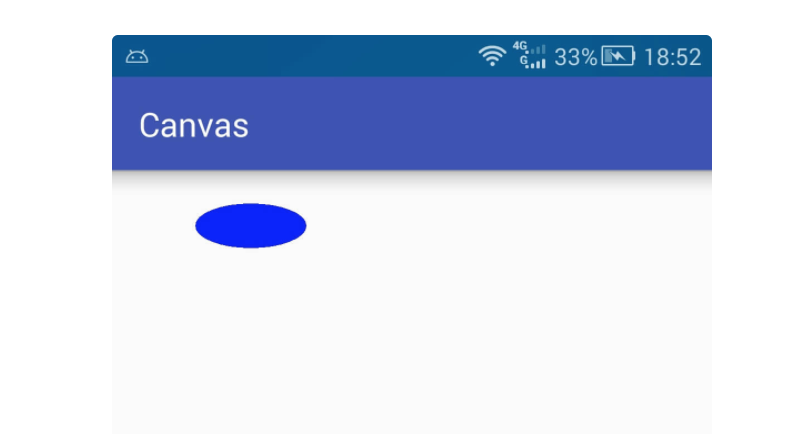
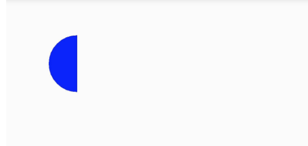
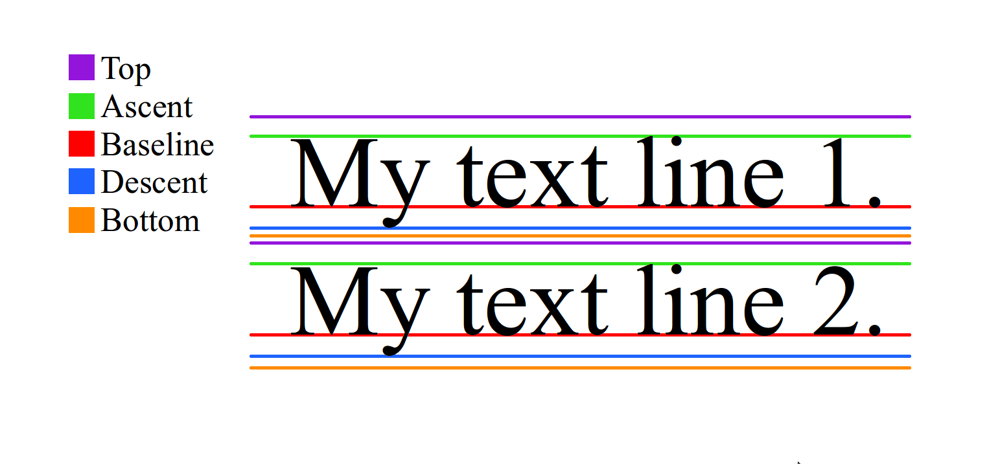

# Canvas图片文字

[安卓自定义View进阶-Canvas之图片文字](http://www.gcssloop.com/customview/Canvas_PictureText)

## drawPicture

- **使用Picture之前，应当关闭硬件加速**

### Picture

- Picture看作是一个录制Canvas操作的录像机
- 将beginRecording与endRecording之间的操作记录下来，然后通过其它的方式将记录的的绘制绘制出来

相关方法                                             | 简介
-----------------------------------------------------|-------------------------------------------------------------------
public int getWidth ()                               | 获取宽度
public int getHeight ()                              | 获取高度
public Canvas beginRecording (int width, int height) | 开始录制 (返回一个Canvas，在Canvas中所有的绘制都会存储在Picture中)
public void endRecording ()                          | 结束录制
public void draw (Canvas canvas)                     | 将Picture中内容绘制到Canvas中

### 将Picture的内容绘制出来

序号 | 简介
-----|---------------------------------------------------------------------
1    | 使用Picture提供的draw方法绘制。
2    | 使用Canvas提供的drawPicture方法绘制。
3    | 将Picture包装成为PictureDrawable，使用PictureDrawable的draw方法绘制。

主要区别           | 分类                         | 简介
-------------------|------------------------------|-------------------------------------------------------
是否对Canvas有影响 | 1有影响2,3不影响             | 此处指绘制完成后是否会影响Canvas的状态(Matrix clip等)
可操作性强弱       | 1可操作性较弱2,3可操作性较强 | 此处的可操作性可以简单理解为对绘制结果可控程度。

```java
// 1.创建Picture
private Picture mPicture = new Picture();

---------------------------------------------------------------

// 2.录制内容方法
private void recording() {
    // 开始录制 (接收返回值Canvas)
    Canvas canvas = mPicture.beginRecording(500, 500);
    // 创建一个画笔
    Paint paint = new Paint();
    paint.setColor(Color.BLUE);
    paint.setStyle(Paint.Style.FILL);

    // 在Canvas中具体操作
    // 位移
    canvas.translate(250,250);
    // 绘制一个圆
    canvas.drawCircle(0,0,100,paint);

    mPicture.endRecording();
}

---------------------------------------------------------------

// 3.在使用前调用(我在构造函数中调用了)
  public Canvas3(Context context, AttributeSet attrs) {
    super(context, attrs);

    recording();    // 调用录制
}
```

#### 使用Picture的draw方法

- **在较低的版本的系统中会影响Canvas的状态，所以这种方法一般不使用**

```java
// 将Picture中的内容绘制在Canvas上
mPicture.draw(canvas);
```

#### 使用Canvas提供的drawPicture方法绘制

```java
public void drawPicture (Picture picture)

/**
* Draw the picture, stretched to fit into the dst rectangle.
*/
public void drawPicture (Picture picture, Rect dst)

public void drawPicture (Picture picture, RectF dst)
```

- **使用drawPicture(Picture,Rect)时，会缩放picture的内容来适应Rect的大小**，从而可能导致Picture的内容发生变形

```java
// 会拉伸picture的内容，使内容全部绘制在矩形中，导致变形
canvas.drawPicture(mPicture,new RectF(0,0,mPicture.getWidth(),200));
```



#### 使用PictureDrawable

- **此处setBounds是设置在画布上的绘制区域，并非根据该区域进行缩放**，也不是剪裁Picture，每次都从Picture的左上角开始绘制

```java
// 包装成为Drawable
PictureDrawable drawable = new PictureDrawable(mPicture);
// 设置绘制区域 -- 注意此处所绘制的实际内容不会缩放
drawable.setBounds(0,0,250,mPicture.getHeight());
// 绘制
drawable.draw(canvas);
```



## drawBitmap

### 方法1

```java
public void drawBitmap (Bitmap bitmap, Matrix matrix, Paint paint)
```

- **matrix用来对bitmap进行矩阵变换**

### 方法2

```java
public void drawBitmap(@NonNull Bitmap bitmap, float left, float top, @Nullable Paint paint)
```

- 将bitmap绘制出来，**其中(left,top)是bitmap的左上角将要绘制的坐标**

### 方法3

```java
public void drawBitmap(@NonNull Bitmap bitmap, @Nullable Rect src, @NonNull RectF dst, @Nullable Paint paint)

public void drawBitmap(@NonNull Bitmap bitmap, @Nullable Rect src, @NonNull Rect dst,@Nullable Paint paint)
```

名称                 | 作用
---------------------|----------------------------------
Rect src             | 如果不为null,表示bitmap的一个子区域
Rect dst 或RectF dst | bitmap将通过拉伸变化绘制到dst区域内

- 用src指定了原图片需要绘制的区域，然后用dst指定了绘制到屏幕上的区域，**图片宽高会根据指定的区域自动进行缩放**

## Canvas的Text绘制

### Paint.FontMetrics

[FontMetrics](https://stackoverflow.com/questions/27631736/meaning-of-top-ascent-baseline-descent-bottom-and-leading-in-androids-font)

```java
public static class FontMetrics {
    /**
    * The maximum distance above the baseline for the tallest glyph in
    * the font at a given text size.
    */
    public float   top;
    /**
    * The recommended distance above the baseline for singled spaced text.
    */
    public float   ascent;
    /**
    * The recommended distance below the baseline for singled spaced text.
    */
    public float   descent;
    /**
    * The maximum distance below the baseline for the lowest glyph in
    * the font at a given text size.
    */
    public float   bottom;
    /**
    * The recommended additional space to add between lines of text.
    */
    public float   leading;
}
```



- **BaseLine**：基准线
- **Ascent**:baseline到字符最高处的距离
- **descent**:baseline到字符最低处的距离
- **Leading**：文档说的很含糊，不太确定，可以认为是一行的bottom到下一行的top之间的距离
- **Top**：指的是该textsize时，字体中最高字符到baseline的值，即ascent的最大值
- **Bottom**：指的是该textsize时，字体中最低字符到baseline的值，即descent的最大值

- **因为坐标系的关系，baseline向下为正，向右为正，所以bottom与top之间的距离应当为bottom-top**

### drawText

```java
// 第一类
public void drawText(@NonNull String text, float x, float y, @NonNull Paint paint)
public void drawText(@NonNull String text, int start, int end, float x, float y, @NonNull Paint paint)
public void drawText(@NonNull CharSequence text, int start, int end, float x, float y,@NonNull Paint paint)
public void drawText(@NonNull char[] text, int index, int count, float x, float y,@NonNull Paint paint)

// 第二类
@Deprecated
public void drawPosText(@NonNull String text, @NonNull @Size(multiple=2) float[] pos, @NonNull Paint paint)

@Deprecated
public void drawPosText(@NonNull char[] text, int index, int count,
            @NonNull @Size(multiple=2) float[] pos,@NonNull Paint paint)

// 第三类
public void drawTextOnPath (String text, Path path, float hOffset, float vOffset, Paint paint)
public void drawTextOnPath (char[] text, int index, int count, Path path, float hOffset, float vOffset, Paint paint)
```

- 绘制文字时，文字的位置由Canvas确定，但是文字的大小，字体等由Paint确定

标题 | 相关方法                  | 备注
-----|---------------------------|-----------------------------------------------------
色彩 | setColor setARGB setAlpha | 设置颜色，透明度
大小 | setTextSize               | 设置文本字体大小
字体 | setTypeface               | 设置或清除字体样式
样式 | setStyle                  | 填充(FILL),描边(STROKE),填充加描边(FILL_AND_STROKE)
对齐 | setTextAlign              | 左对齐(LEFT),居中对齐(CENTER),右对齐(RIGHT)
测量 | measureText               | 测量文本大小(注意，请在设置完文本各项参数后调用)

### 第一类

- 第一类可以指定了文本开始的位置，可以截取文本中部分内容进行绘制
- **基线x默认在字符串左侧，基线y也就是文本的FontMetrics的baseLine的位置**

### 第二类

- **必须指定每一个字符的位置，来绘制文本**
- 不建议使用，标记为Deprecated

序号 | 反对理由
-----|-------------------------------------------------
1    | 必须指定所有字符位置，否则直接crash掉，反人类设计
2    | 性能不佳，在大量使用的时候可能导致卡顿
3    | 不支持emoji等特殊字符，不支持字形组合与分解

### 第三类

- 与 Path相关