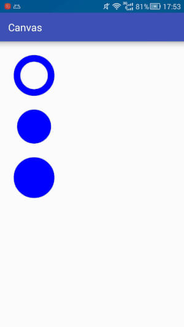
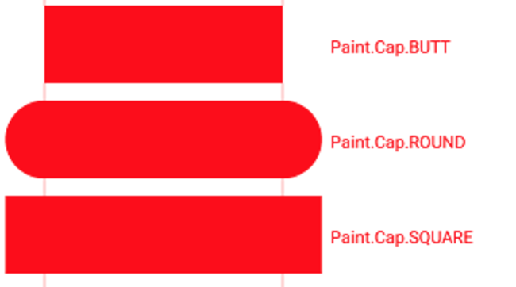

# Paint基础

- [构造函数](#构造函数)
- [Paint.Style](#paintstyle)
- [Paint.Cap](#paintcap)
- [Paint.Join](#paintjoin)
- [Paint.Align](#paintalign)
- [其它常用方法](#其它常用方法)
- [setColorFilter(ColorFilter filter)](#setcolorfiltercolorfilter-filter)
    - [ColorMatrixColorFilter](#colormatrixcolorfilter)
        - [Fresco中的灰度处理](#fresco中的灰度处理)
    - [LightingColorFilter](#lightingcolorfilter)
    - [PorterDuffColorFilter](#porterduffcolorfilter)

## 构造函数

```java
//创建一个画笔对象
Paint()；

//在构造的时候可以传入一些定义好的属性，flags与用setFlags()一样
Paint(int flags);

//使用构造函数中Paint的属性生成一个新的Paint
Paint(Paint paint);
```

## Paint.Style

- Paint.Style.FILL：填充内部
- Paint.Style.FILL_AND_STROKE  ：填充内部和描边
- Paint.Style.STROKE  ：描边
- 其中**STROKE注意是外描边**



## Paint.Cap



## Paint.Join


## Paint.Align

- Paint.Align.LEFT
- Paint.Align.CENTER
- Paint.Align.RIGHT

## 其它常用方法

```java
//重置Paint。
reset()

//设置画笔颜色
setColor(int color)

//设置画笔的透明度[0-255]，0是完全透明，255是完全不透明
setAlpha(int a)

//设置画笔颜色，argb形式alpha，red，green，blue每个范围都是[0-255],
setARGB(int a, int r, int g, int b)

//设置一些标志，比如抗锯齿，下划线等等。
setFlags(int flags)

//设置抗锯齿，如果不设置，加载位图的时候可能会出现锯齿状的边界，如果设置，边界就会变的稍微有点模糊，锯齿就看不到了。
setAntiAlias(boolean aa)

//设置是否抖动，如果不设置感觉就会有一些僵硬的线条，如果设置图像就会看的更柔和一些，
setDither(boolean dither)

//对位图进行滤波处理，如果该项设置为true，则图像在动画进行中会滤掉对Bitmap图像的优化操作，加快显示
setFilterBitmap(boolean filter)

setStyle(Style style)，setStrokeCap(Cap cap)，setStrokeJoin(Join join)，setTextAlign(Align align)

//画笔样式为空心时，设置空心画笔的宽度
setStrokeWidth(float width)

//当style为Stroke或StrokeAndFill时设置连接处的倾斜度，这个值必须大于0
setStrokeMiter(float miter)

//设置着色器，用来给图像着色的，绘制出各种渐变效果，有BitmapShader，ComposeShader，LinearGradient，RadialGradient，SweepGradient几种，这个以后再单独讲
setShader(Shader shader)

//设置画笔颜色过滤器，有ColorMatrixColorFilter，LightingColorFilter，PorterDuffColorFilter几种，这个以后再单独分析
setColorFilter(ColorFilter filter)

//设置图形重叠时的显示方式，下面来演示一下
setXfermode(Xfermode xfermode)

//设置绘制路径的效果，有ComposePathEffect，CornerPathEffect，DashPathEffect，DiscretePathEffect，PathDashPathEffect，SumPathEffect几种，以后在单独分析
setPathEffect(PathEffect effect)

//对图像进行一定的处理，实现滤镜的效果，如滤化，立体等,有BlurMaskFilter，EmbossMaskFilter几种
setMaskFilter(MaskFilter maskfilter)

//设置阴影效果，radius为阴影角度，dx和dy为阴影在x轴和y轴上的距离，color为阴影的颜色 ，看一下演示效果，其中第一个是没有阴影的，第二个设置了黑色的阴影
setShadowLayer(float radius, float dx, float dy, int shadowColor)


//设置字体样式，可以是Typeface设置的样式，也可以通过Typeface的createFromAsset(AssetManager mgr, String path)方法加载样式
setTypeface(Typeface typeface)

//这个是文本缓存，设置线性文本，如果设置为true就不需要缓存，
setLinearText(boolean linearText)

//设置亚像素，是对文本的一种优化设置，可以让文字看起来更加清晰明显，可以参考一下PC端的控制面板-外观和个性化-调整ClearType文本
setSubpixelText(boolean subpixelText)

//设置文本的下划线
setUnderlineText(boolean underlineText)

//设置文本的删除线
setStrikeThruText(boolean strikeThruText)

//设置文本粗体
setFakeBoldText(boolean fakeBoldText)

//设置地理位置，比如显示中文，日文，韩文等，默认的显示Locale.getDefault()即可，
setTextLocale(Locale locale)

//设置优雅的文字高度，这个设置可能会对FontMetrics产生影响
setElegantTextHeight(boolean elegant)

//设置字体大小
setTextSize(float textSize)

//设置字体的水平方向的缩放因子，默认值为1，大于1时会沿X轴水平放大，小于1时会沿X轴水平缩小
setTextScaleX(float scaleX)

//设置文本在水平方向上的倾斜，默认值为0，推荐的值为-0.25，
setTextSkewX(float skewX)

//设置行的间距，默认值是0，负值行间距会收缩
setLetterSpacing(float letterSpacing)

//设置字体样式，可以设置CSS样式
setFontFeatureSettings(String settings)

//下面几个就是测量字体的长度了
measureText(char[] text, int index, int count)
measureText(String text, int start, int end)
measureText(String text)
measureText(CharSequence text, int start, int end)

//下面这几个就是剪切显示，就是大于maxWidth的时候只截取指定长度的显示
breakText(char[] text, int index, int count,float maxWidth, float[] measuredWidth)
breakText(CharSequence text, int start, int end,boolean measureForwards,  floatmaxWidth, float[] measuredWidth)
breakText(String text, boolean measureForwards,float maxWidth, float[] measuredWidth)

//提取指定范围内的字符串，保存到widths中，
getTextWidths(char[] text, int index, int count,float[] widths)
getTextWidths(CharSequence text, int start, int end, float[] widths)
getTextWidths(String text, int start, int end, float[] widths)
getTextWidths(String text, float[] widths)

//获取文本绘制的路径，提取到Path中，
getTextPath(char[] text, int index, int count, float x, float y, Path path)
getTextPath(String text, int start, int end, float x, float y, Path path)

//得到文本的边界，上下左右，提取到bounds中，可以通过这计算文本的宽和高
getTextBounds(String text, int start, int end, Rect bounds)
getTextBounds(char[] text, int index, int count, Rect bounds)
```

## setColorFilter(ColorFilter filter)

- 设置颜色过滤器,可以通过颜色过滤器过滤掉对应的色值，比如图像灰度处理，生成老照片效果

- ColorFilter有以下几个子类可用: ColorMatrixColorFilter, LightingColorFilter, PorterDuffColorFilter

### ColorMatrixColorFilter

[ColorMatrix](http://developer.Android.com/reference/android/graphics/ColorMatrix.html)

- 在Android中，图片是以一个个 RGBA 的像素点的形式加载到内存中的，所以如果需要改变图片的颜色，就需要针对这一个个像素点的RGBA的值进行修改，其实主要是RGB，A是透明度；

- 修改图片 RGBA 的值需要ColorMatrix类的支持，它定义了一个 4*5 的float[]类型的矩阵，矩阵中每一行表示 RGBA 中的一个参数

- 展示的颜色效果取决于图像的RGBA（红色、绿色、蓝色、透明度）值。而图像的 RGBA 值则存储在一个5*1的颜色分量矩阵C中，由颜色分量矩阵C可以控制图像的颜色效果

- 为了改变图像的显示效果，只需要改变 4*5 的颜色矩阵ColorMatrix，然后通过矩阵计算，即可得到新的图像显示矩阵


- 通过颜色矩阵 ColorMatrix 修改了原图像的 RGBA 值，从而达到了改变图片颜色效果的目的。并且，通过如上图所示的运算可知，颜色矩阵 ColorMatrix 的第一行参数abcde决定了图像的红色成分，第二行参数fghij决定了图像的绿色成分，第三行参数klmno决定了图像的蓝色成分，第四行参数pqrst决定了图像的透明度，第五列参数ejot是颜色的偏移量

- 我们利用ColorFilter 和 ColorMatrixColorFilter类和 Paint 的setColorFilter 就可以改变图片的展示效果（颜色，饱和度，对比度等），从而得到类似市面上图像软件中的黑白老照片、泛黄旧照片、羞涩的青春等等特效

#### Fresco中的灰度处理

```java
public class GrayPostprocessor extends BasePostprocessor {

    private static final GrayPostprocessor GRAY_PROCESSOR = new GrayPostprocessor();

    public static GrayPostprocessor get() {
        return GRAY_PROCESSOR;
    }

    private GrayPostprocessor() {
    }

    @Override
    public String getName() {
        return "GrayPostprocessor";
    }

    @Override
    public void process(Bitmap bitmap) {
        Canvas c = new Canvas(bitmap);
        Paint paint = new Paint();
        ColorMatrix cm = new ColorMatrix();
        cm.setSaturation(0);
        ColorMatrixColorFilter f = new ColorMatrixColorFilter(cm);
        paint.setColorFilter(f);
        c.drawBitmap(bitmap, 0, 0, paint);
    }
}
```

### LightingColorFilter

- 光照颜色过滤,该类有且只有一个构造方法：

```java
LightingColorFilter (int mul, int add);
```

- mul全称是colorMultiply意为色彩倍增，而add全称是colorAdd意为色彩添加，这两个值都是16进制的色彩值0xAARRGGBB。

- 最后生成的颜色计算方法为

```java
 newR = R * colorMultiply.R + colorAdd.R;
 newG = G * colorMultiply.G + colorAdd.G;
 newB = B * colorMultiply.B + colorAdd.B;
```

- LightingColorFilter(0xFFFFFFFF, 0x00000000)的时候原图是不会有任何改变的，如果我们想增加红色的值，那么LightingColorFilter(0xFFFFFFFF, 0x00XX0000)就好，其中XX取值为00至FF

```java
// 我们想要去掉绿色
@Override
protected void onDraw(Canvas canvas) {
    super.onDraw(canvas);

    // 设置颜色过滤
    mPaint.setColorFilter(new LightingColorFilter(0xFFFF00FF, 0x00000000));

    Bitmap bitmap = BitmapFactory.decodeResource(mContext.getResources(), R.drawable.kale);
    canvas.drawBitmap(bitmap,240,600,mPaint);
}
```


### PorterDuffColorFilter

- PorterDuffColorFilter跟LightingColorFilter一样，只有一个构造方法：

```java
PorterDuffColorFilter(int color, PorterDuff.Mode mode)
```

- 这个构造方法也接受两个值，一个是16进制表示的颜色值，而另一个是PorterDuff内部类Mode中的一个常量值，这个值表示混合模式。

- 将画布上的元素和我们设置的color进行混合，产生最终的效果。

```java
@Override
    protected void onDraw(Canvas canvas) {
        super.onDraw(canvas);

        // 设置颜色过滤
        mPaint.setColorFilter(new PorterDuffColorFilter(Color.RED, PorterDuff.Mode.DARKEN));

        Bitmap bitmap = BitmapFactory.decodeResource(mContext.getResources(), R.drawable.kale);
        canvas.drawBitmap(bitmap,240,600,mPaint);
    }
```

- 但是这里要注意一点，PorterDuff.Mode中的模式不仅仅是应用于图像色彩混合，还应用于图形混合，比如PorterDuff.Mode.DST_OUT就表示裁剪混合图。