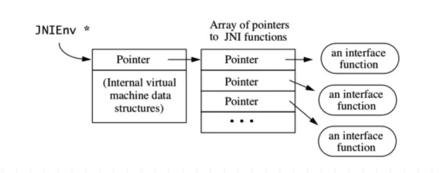
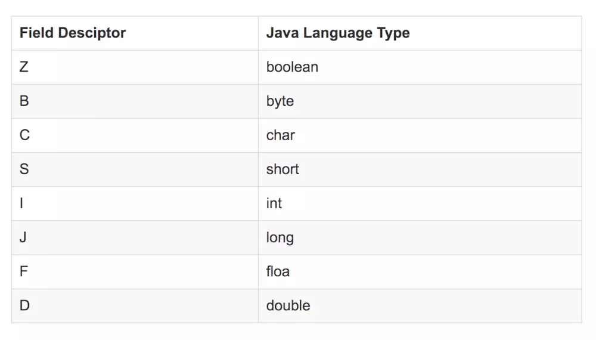

# jni 基础

-   [Android NDK 开发：JNI 基础篇](https://www.jianshu.com/p/ac00d59993aa)
-   [JNI Tips](http://hukai.me/android-training-course-in-chinese/performance/perf-jni/index.html)

## JNIEnv



-   JNIEnv 是 jni.h 文件最重要的部分，它的本质是指向函数表指针的指针 JavaVM 也是
-   JNIEnv 是一个指针，指向一组 JNI 函数，通过这些函数可以实现 Java 层和 JNI 层的交互，就是说通过 JNIEnv 调用 JNI 函数可以访问 Java 虚拟机，操作 Java 对象；
-   所有本地函数都会接收 JNIEnv 作为第一个参数；（C++ 的 JNI 函数已经对 JNIEnv 参数进行了封装，不用写在函数参数上）
-   **JNIEnv 用作线程局部存储，不能在线程间共享一个 JNIEnv 变量，也就是说 JNIEnv 只在创建它的线程有效，不能跨线程传递；相同的 Java 线程调用本地方法，所使用的 JNIEnv 是相同的，一个 native 方法不能被不同的 Java 线程调用；**

### JavaEnv 和 JavaVM 的关系

-   **每个进程只有一个 JavaVM**,理论上一个进程可以拥有多个 JavaVM 对象，但 Android 只允许一个
-   每个线程都会有一个 JNIEnv，大部分 JNIAPI 通过 JNIEnv 调用；也就是说，**Android 中 JNI 全局只有一个 JavaVM，而可能有多个 JNIEnv；**
-   一个 JNIEnv 内部包含一个 Pointer，Pointer 指向 Dalvik 的 JavaVM 对象的 Function Table，JNIEnv 内部的函数执行环境来源于 Dalvik 虚拟机；
-   **Java 每个线程在和 C/C++ 互相调用时，JNIEnv 是互相独立，互不干扰的**，这样就提升了并发执行时的安全性；
-   当本地的 C/C++ 代码想要获得当前线程所想要使用的 JNIEnv 时，可以使用 Dalvik VM 对象的 JavaVM* jvm->GetEnv()方法，该方法会返回当前线程所在的 JNIEnv*；

### C 语言的 JavaEnv

-   C 语言的 JNIEnv 就是 const struct JNINativeInterface*，而 JNIEnv* env 就等价于 JNINativeInterface\** env，env 实际是一个二级指针，所以想要得到 JNINativeInterface 结构体中定义的函数指针，就需要先获取 JNINativeInterface 的一级指针对象*env，然后才能通过一级指针对象调用 JNI 函数

```c++
#if defined(__cplusplus)
typedef _JNIEnv JNIEnv;
typedef _JavaVM JavaVM;
#else
typedef const struct JNINativeInterface* JNIEnv;
typedef const struct JNIInvokeInterface* JavaVM;
#endif
```

```c++
(*env)->NewStringUTF(env, "hello")
```

### C++的 JavaEnv

-   由 typedef \_JNIEnv JNIEnv;可知，C++的 JNIEnv 是 \_JNIEnv 结构体，而 \_JNIEnv 结构体定义了 JNINativeInterface 的结构体指针，内部定义的函数实际上是调用 JNINativeInterface 的函数，所以 C++的 env 是一级指针，调用时不需要加 env 作为函数的参数，例如：env->NewStringUTF(env, "hello")

```c++
#if defined(__cplusplus)
typedef _JNIEnv JNIEnv;
typedef _JavaVM JavaVM;
#else
typedef const struct JNINativeInterface* JNIEnv;
typedef const struct JNIInvokeInterface* JavaVM;
#endif
```

```c++
env->NewStringUTF(env, "hello")
```

### 线程

-   所有的线程都是 Linux 线程，由内核统一调度。Android 中一般通过 Thread.start 创建，但它们也能够在其他任何地方创建，然后连接（attach）到 JavaVM。
-   **一个用 pthread_create 启动的线程能够使用 JNI AttachCurrentThread 或 AttachCurrentThreadAsDaemon 函数连接到 JavaVM。在一个线程成功连接（attach）之前，它没有 JNIEnv，不能够调用 JNI 函数**
-   连接一个本地环境创建的线程会触发构造一个 java.lang.Thread 对象，然后其被添加到主线程群组（main ThreadGroup）,以让调试器可以探测到。对一个已经连接的线程使用 AttachCurrentThread 不做任何操作（no-op）
-   **安卓不能中止正在执行本地代码的线程**。如果正在进行垃圾回收，或者调试器已发出了中止请求，安卓会在下一次调用 JNI 函数的时候中止线程
-   **连接过的（attached）线程在它们退出之前必须通过 JNI 调用 DetachCurrentThread**。如果你觉得直接这样编写不太优雅，在安卓 2.0（Eclair）及以上， 你可以使用 pthread_key_create 来定义一个析构函数，它将会在线程退出时被调用，你可以在那儿调用 DetachCurrentThread （使用生成的 key 与 pthread_setspecific 将 JNIEnv 存储到线程局部空间内；这样 JNIEnv 能够作为参数传入到析构函数当中去

### 局部引用与全局引用

#### 局部引用

-   **每个传入本地方法的参数，以及大部分 JNI 函数返回的每个对象都是“局部引用”**。这意味着它只在当前线程的当前方法执行期间有效。即使这个对象本身在本地方法返回之后仍然存在，这个引用也是无效的
-   开发者需要“不过度分配”局部引用。**在实际操作中这意味着如果你正在创建大量的局部引用，或许是通过对象数组，你应该使用 DeleteLocalRef 手动地释放它们，而不是寄希望 JNI 来为你做这些**。实现上只预留了 16 个局部引用的空间，所以如果你需要更多，要么你删掉以前的，要么使用 EnsureLocalCapacity/PushLocalFrame 来预留更多。
-   有一种不常见的情况值得一提，**如果你使用 AttachCurrentThread 连接（attach）了本地进程，正在运行的代码在线程分离（detach）之前决不会自动释放局部引用**。你创建的任何局部引用必须手动删除。通常，任何在循环中创建局部引用的本地代码可能都需要做一些手动删除

#### 全局引用

-   **如果你想持有一个引用更长的时间，你就必须使用一个全局（“global”）引用了。NewGlobalRef 函数以一个局部引用作为参数并且返回一个全局引用。全局引用能够保证在你调用 DeleteGlobalRef 前都是有效的**

```c++
jclass localClass = env->FindClass("MyClass");
jclass globalClass = reinterpret_cast<jclass>(env->NewGlobalRef(localClass));
```

-   所有的 JNI 方法都接收局部引用和全局引用作为参数。
-   **相同对象的引用却可能具有不同的值，用相同对象连续地调用 NewGlobalRef 得到返回值可能是不同的**
-   **为了检查两个引用是否指向的是同一个对象，你必须使用 IsSameObject 函数。绝不要在本地代码中用==符号来比较两个引用**
-   得出的结论是**绝不要在本地代码中假定对象的引用是常量或者是唯一的**
-   **注意 jfieldID 和 jmethodID 是映射类型（opaque types），不是对象引用，不应该被传入到 NewGlobalRef。**原始数据指针，像 GetStringUTFChars 和 GetByteArrayElements 的返回值，也都不是对象（它们能够在线程间传递，并且在调用对应的 Release 函数之前都是有效的

## jni 数据映射

### 基本类型

```c++
/* Primitive types that match up with Java equivalents. */
typedef uint8_t  jboolean; /* unsigned 8 bits */
typedef int8_t   jbyte;    /* signed 8 bits */
typedef uint16_t jchar;    /* unsigned 16 bits */
typedef int16_t  jshort;   /* signed 16 bits */
typedef int32_t  jint;     /* signed 32 bits */
typedef int64_t  jlong;    /* signed 64 bits */
typedef float    jfloat;   /* 32-bit IEEE 754 */
typedef double   jdouble;  /* 64-bit IEEE 754 */

/* "cardinal indices and sizes" */
typedef jint     jsize;
```

### String

-   Java 层的字符串到了 JNI 就成了 jstring 类型的，但 jstring 指向的是 JVM 内部的一个字符串，它不是 C 风格的字符串 char\*，所以不能像使用 C 风格字符串一样来使用 jstring
    -   GetStringUTFChars 将 jstring 转换成为 UTF-8 格式的 char\*
    -   GetStringChars 将 jstring 转换成为 Unicode 格式的 char\*
    -   ReleaseStringUTFChars 释放指向 UTF-8 格式的 char\*的指针
    -   ReleaseStringChars 释放指向 Unicode 格式的 char\*的指针
    -   NewStringUTF 创建一个 UTF-8 格式的 String 对象
    -   NewString 创建一个 Unicode 格式的 String 对象
    -   GetStringUTFLength 获取 UTF-8 格式的 char\*的长
    -   GetStringLength 获取 Unicode 格式的 char\*的长度

```java
public static native String getNativeString(String str);
```

```c++
JNIEXPORT jstring JNICALL
Java_cradle_rancune_tech_jni_JniTest_getNativeString(JNIEnv *env, jclass clazz, jstring string) {
    // 将 jstring 类型的字符串转换为 C 风格的字符串,会额外申请内存
    const char * str = (*env) -> GetStringUTFChars(env, string, NULL);
    if (str == NULL) {
        return NULL;
    }
    printf("%s", str);
    // 使用完后，需要释放掉申请的 C 风格字符串的内存
    (*env) -> ReleaseStringUTFChars(env, string, str);
    // 生成 jstring 类型的字符串
    jstring returnValue = (*env) -> NewStringUTF(env, "Hello World");
    return returnValue;
}
```

#### 注意事项

-   GetStringUTFChars 可以把一个 jstring 指针转化成一个 UTF-8 格式的 C 字符串。
-   从 GetStringUTFChars 中获取的 UTF-8 字符串在本地代码中使用完毕后，要使用 ReleaseStringUTFChars 告诉 JVM 这个 UTF-8 字符串不会被使用了，因为这个 UTF-8 字符串占用的内存会被回收。
-   JNI 函数 NewString 在本地方法中创建一个新的 java.lang.String 字符串对象.这个新创建的字符串对象拥有一个与给定的 UTF-8 编码的 C 类型字符串内容相同的 Unicode 编码字符串, NewStringUTF 则是一个 UTF-8 的 jstring 对象
-   由于 UTF-8 编码的字符串以 \0 结尾，而 Unicode 字符串不是，所以对于两种编码获得字符串长度的函数也是不同的，**如果一个 jstring 指向一个 UTF-8 编码的字符串，为了得到这个字符串的字节长度，可以调用标准 C 函数 strlen,当然也可以用 GetStringUTFLength**

```c
const jchar * GetStringChars(JNIEnv *env, jstring str, jboolean *isCopy);
```

-   GetStringChars 和 GetStringUTFChars 函数中的第三个参数 isCopy：
    -   如果为 JNI_TRUE 则返回拷贝，并且要为产生的字符串拷贝分配内存空间
    -   如果为 JNI_FALSE 就直接返回了 JVM 源字符串的指针，意味着可以通过指针修改源字符串的内容，但这就违反了 Java 中字符串不能修改的规定
    -   在实际开发中，直接填 NULL 就好了
    -   **当调用完 GetStringUTFChars 方法时别忘了做完全检查。因为 JVM 需要为产生的新字符串分配内存空间**，如果分配失败就会返回 NULL，并且会抛出 OutOfMemoryError 异常，所以要对 GetStringUTFChars 结果进行判断

#### jni 对应 string 方法的选择


### 引用类型

-   当是 C++环境时，jobject, jclass, jstring, jarray 等都是继承自\_jobject 类
-   **而在 C 语言环境是，则它的本质都是空类型指针 typedef void\* jobject**

```c++
#ifdef __cplusplus
/*
 * Reference types, in C++
 */
class _jobject {};
class _jclass : public _jobject {};
class _jstring : public _jobject {};
class _jarray : public _jobject {};
class _jobjectArray : public _jarray {};
class _jbooleanArray : public _jarray {};
class _jbyteArray : public _jarray {};
class _jcharArray : public _jarray {};
class _jshortArray : public _jarray {};
class _jintArray : public _jarray {};
class _jlongArray : public _jarray {};
class _jfloatArray : public _jarray {};
class _jdoubleArray : public _jarray {};
class _jthrowable : public _jobject {};

typedef _jobject*       jobject;
typedef _jclass*        jclass;
typedef _jstring*       jstring;
typedef _jarray*        jarray;
typedef _jobjectArray*  jobjectArray;
typedef _jbooleanArray* jbooleanArray;
typedef _jbyteArray*    jbyteArray;
typedef _jcharArray*    jcharArray;
typedef _jshortArray*   jshortArray;
typedef _jintArray*     jintArray;
typedef _jlongArray*    jlongArray;
typedef _jfloatArray*   jfloatArray;
typedef _jdoubleArray*  jdoubleArray;
typedef _jthrowable*    jthrowable;
typedef _jobject*       jweak;


#else /* not __cplusplus */

/*
 * Reference types, in C.
 */
typedef void*           jobject;
typedef jobject         jclass;
typedef jobject         jstring;
typedef jobject         jarray;
typedef jarray          jobjectArray;
typedef jarray          jbooleanArray;
typedef jarray          jbyteArray;
typedef jarray          jcharArray;
typedef jarray          jshortArray;
typedef jarray          jintArray;
typedef jarray          jlongArray;
typedef jarray          jfloatArray;
typedef jarray          jdoubleArray;
typedef jobject         jthrowable;
typedef jobject         jweak;

#endif /* not __cplusplus */

```

### 引用类型使用

-   **引用类型不能直接在 Native 层使用，需要根据 JNI 函数进行类型的转化后，才能使用**
-   多维数组（含二维数组）都是引用类型，需要使用 jobjectArray 类型存取其值

```c++
// int[][10]
// c++写法
jclass intArrayclss = env->FindClass("[I");
jobjectArray objectIntArray = env->NewObjectArray(10, intArrayclss,NULL);

// c语言写法
jclass intArrayClass = (*env) -> FindClass(env, "[I");
jobjectArray array = (*env) ->NewObjectArray(env, 10, intArrayClass, NULL);
```

## 方法和变量 ID

-   同样不能直接在 Native 层使用。
-   **当 Native 层需要调用 Java 的某个方法时，需要通过 JNI 函数获取它的 ID，根据 ID 调用 JNI 函数获取该方法**；变量的获取也是类似
-   成员 ID 方法 ID 都定义为不透明数据结构，[C 语言中的不透明数据类型（opaque structure)](https://blog.csdn.net/icesprings/article/details/7986416)

```c++
struct _jfieldID;                       /* opaque structure */
typedef struct _jfieldID* jfieldID;     /* field IDs */

struct _jmethodID;                      /* opaque structure */
typedef struct _jmethodID* jmethodID;   /* method IDs */
```

## JNI 描述符

### 域描述符

#### 基本类型描述符

-   **除了 boolean 和 long 类型分别是 Z 和 J 外，其他的描述符对应的都是 Java 类型名的大写首字母**。另外，void 的描述符为 V



#### 引用类型描述符

-   一般引用类型描述符的规则如下，注意不要丢掉“；”

```c++
L + 类描述符 + ;
```

String 类型的域描述符为

```c++
Ljava/lang/String;
```

-   数组的域描述符特殊一点，如下，其中有多少级数组就有多少个“[”，数组的类型为类时，则有分号，为基本类型时没有分号

```c++
[ + 其类型的域描述符

int[]    描述符为 [I
double[] 描述符为 [D
String[] 描述符为 [Ljava/lang/String;
Object[] 描述符为 [Ljava/lang/Object;
int[][]  描述符为 [[I
double[][] 描述符为 [[D
```

#### 获得域 ID 与域对象

-   首先根据域的名字 name 与描述符 sig 获得 FieldID
-   然后根据是基本类型还是类类型，调用对应的 Get(Type)Field 方法

```c++
jfieldID GetFieldID(jclass clazz, const char* name, const char* sig)
    { return functions->GetFieldID(this, clazz, name, sig); }

jobject GetObjectField(jobject obj, jfieldID fieldID)
    { return functions->GetObjectField(this, obj, fieldID); }

jboolean GetBooleanField(jobject obj, jfieldID fieldID)
    { return functions->GetBooleanField(this, obj, fieldID); }

jbyte GetByteField(jobject obj, jfieldID fieldID)
    { return functions->GetByteField(this, obj, fieldID); }

jchar GetCharField(jobject obj, jfieldID fieldID)
    { return functions->GetCharField(this, obj, fieldID); }

jshort GetShortField(jobject obj, jfieldID fieldID)
    { return functions->GetShortField(this, obj, fieldID); }

jint GetIntField(jobject obj, jfieldID fieldID)
    { return functions->GetIntField(this, obj, fieldID); }

jlong GetLongField(jobject obj, jfieldID fieldID)
    { return functions->GetLongField(this, obj, fieldID); }

jfloat GetFloatField(jobject obj, jfieldID fieldID)
    { return functions->GetFloatField(this, obj, fieldID); }

jdouble GetDoubleField(jobject obj, jfieldID fieldID)
    { return functions->GetDoubleField(this, obj, fieldID); }
```

#### 静态域 ID 与域对象

-   **静态域与方法不能调用普通的获得普通成员与普通方法的函数**
-   首先根据域的名字 name 与描述符 sig 获得 FieldID
-   然后根据是基本类型还是类类型，调用对应的 GetStatic(Type)Field 方法

```c++
// c
// 首先获得对应的ID
jfieldID GetStaticFieldID(jclass clazz, const char* name, const char* sig)
    { return functions->GetStaticFieldID(this, clazz, name, sig); }

jobject GetStaticObjectField(jclass clazz, jfieldID fieldID)
    { return functions->GetStaticObjectField(this, clazz, fieldID); }

jboolean GetStaticBooleanField(jclass clazz, jfieldID fieldID)
    { return functions->GetStaticBooleanField(this, clazz, fieldID); }

jbyte GetStaticByteField(jclass clazz, jfieldID fieldID)
    { return functions->GetStaticByteField(this, clazz, fieldID); }

jchar GetStaticCharField(jclass clazz, jfieldID fieldID)
    { return functions->GetStaticCharField(this, clazz, fieldID); }

jshort GetStaticShortField(jclass clazz, jfieldID fieldID)
    { return functions->GetStaticShortField(this, clazz, fieldID); }

jint GetStaticIntField(jclass clazz, jfieldID fieldID)
    { return functions->GetStaticIntField(this, clazz, fieldID); }

jlong GetStaticLongField(jclass clazz, jfieldID fieldID)
    { return functions->GetStaticLongField(this, clazz, fieldID); }

jfloat GetStaticFloatField(jclass clazz, jfieldID fieldID)
    { return functions->GetStaticFloatField(this, clazz, fieldID); }

jdouble GetStaticDoubleField(jclass clazz, jfieldID fieldID)
    { return functions->GetStaticDoubleField(this, clazz, fieldID); }
```

### 类描述符

-   类描述符是类的完整名称：包名+类名，java 中包名用 . 分割，jni 中改为用 / 分割如，Java 中 java.lang.String 类的描述符为 java/lang/String
-   native 层获取 Java 的类对象，需要通过 FindClass() 函数获取

```c++
//C
jclass  (*FindClass)(JNIEnv*, const char*);
//C++
jclass FindClass(const char* name)
    { return functions->FindClass(this, name); }

// 查找cn.cfanr.jni.JniTest的class对象
jclass jclazz = env->FindClass("Lcn/cfanr/jni/JniTest;");
```

### 方法描述符

-   方法描述符需要将所有参数类型的域描述符按照声明顺序放入括号，然后再加上返回值类型的域描述符
-   其中没有参数时，不需要括号

```c++
(参数……)返回类型

Java 层方法   ——>  JNI 函数签名
String getString()  ——>  Ljava/lang/String; 或者 ()Ljava/lang/String;
int sum(int a, int b)  ——>  (II)I
void main(String[] args) ——> ([Ljava/lang/String;)V
```

-   在 jni.h 获取 Java 方法的 native 函数如下，其中 jclass 是获取到的类对象，name 是 Java 对应的方法名字，sig 就是上面说的方法描述符

```c++
//C++
// 成员方法
jmethodID GetMethodID(jclass clazz, const char* name, const char* sig)
    { return functions->GetMethodID(this, clazz, name, sig); }

// 静态方法
jmethodID GetStaticMethodID(jclass clazz, const char* name, const char* sig)
    { return functions->GetStaticMethodID(this, clazz, name, sig); }
```

## JNI 的注册

### 静态注册

-   使用 javah 生成相应的代码
-   静态注册的方式有两个重要的关键词 JNIEXPORT 和 JNICALL，这两个关键词是宏定义，主要是注明该函数式是 JNI 函数，当虚拟机加载 so 库时，如果发现函数含有这两个宏定义时，就会链接到对应的 Java 层的 native 方法

### 动态注册

-   **原理**：直接告诉 native 方法其在 JNI 中对应函数的指针。通过使用 JNINativeMethod 结构来保存 Java native 方法和 JNI 函数关联关系
-   实现布骤
    -   先编写 Java 的 native 方法；
    -   编写 JNI 函数的实现（函数名可以随便命名）；
    -   利用结构体 JNINativeMethod 保存 Java native 方法和 JNI 函数的对应关系；
    -   利用 registerNatives(JNIEnv\* env)注册类的所有本地方法；
    -   在 JNI_OnLoad 方法中调用注册方法；
    -   在 Java 中通过 System.loadLibrary 加载完 JNI 动态库之后，会调用 JNI_OnLoad 函数，完成动态注册；
