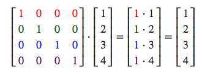

# 3D绘图基本概念

## 参考资料

- [LearnOpenGL CN](https://learnopengl-cn.github.io/)
- [OpenGL教程](https://blog.csdn.net/junzia/article/list/3)

## Vertex Array

- Android中使用ByteBuffer存储我们定义的顶点数组数据

```java
private final float vertices[] = {
    -0.5f, 0.5f, 0.0f,  // 0, Top Left
    -0.5f, -0.5f, 0.0f,  // 1, Bottom Left
    0.5f, -0.5f, 0.0f,  // 2, Bottom Right
    0.5f, 0.5f, 0.0f,  // 3, Top Right
};

private final FloatBuffer vertexBuffer;

// 每个float有4位
ByteBuffer vb = ByteBuffer.allocateDirect(vertices.length * 4);
vb.order(ByteOrder.nativeOrder());
vertexBuffer = vb.asFloatBuffer();
vertexBuffer.put(vertices);
vertexBuffer.position(0);
```

## 图形渲染管线(Graphics Pipeline)

- 图形渲染管线接受一组3D坐标，然后把它们转变为你屏幕上的有色2D像素输出。
- 图形渲染管线可以被划分为几个阶段，**每个阶段将会把前一个阶段的输出作为输入**。所有这些阶段都是高度专门化的（它们都有一个特定的函数），并且很容易并行执行。正是由于它们具有并行执行的特性，当今大多数显卡都有成千上万的小处理核心，它们在GPU上为每一个（渲染管线）阶段运行各自的小程序，从而在图形渲染管线中快速处理你的数据。**这些小程序叫做着色器(Shader)**.
- 有些着色器允许开发者自己配置，这就允许我们用自己写的着色器来替换默认的。这样我们就可以更细致地控制图形渲染管线中的特定部分了，而且因为它们运行在GPU上，所以它们可以给我们节约宝贵的CPU时间
- 下图为图形渲染管线的每个阶段的抽象展示，**蓝色部分代表的是我们可以注入自定义的着色器的部分**


### Shader

- 着色器的开头总是要声明版本，接着是输入和输出变量、uniform和main函数。
- 每个着色器的入口点都是main函数，在这个函数中我们处理所有的输入变量，并将结果输出到输出变量中

```c
// 典型的着色器代码结构
#version version_number
in type in_variable_name;
in type in_variable_name;

out type out_variable_name;

uniform type uniform_name;

int main()
{
  // 处理输入并进行一些图形操作
  ...
  // 输出处理过的结果到输出变量
  out_variable_name = weird_stuff_we_processed;
}
```

## 变换

### 矩阵

#### 单位矩阵



#### 缩放

- 如果我们把缩放变量表示为(S1,S2,S3)我们可以为任意向量(x,y,z)定义一个缩放矩阵


#### 位移

- 如果我们把位移向量表示为(Tx,Ty,Tz)，我们就能把位移矩阵定义为：


#### 旋转

- 旋转矩阵在3D空间中每个单位轴都有不同定义，旋转角度用θ表示

- 沿X轴旋转


- 沿Y轴旋转


- 沿Z轴旋转


#### 矩阵的组合

- 假设我们有一个顶点(x, y, z)，我们希望将其缩放2倍，然后位移(1, 2, 3)个单位。我们需要一个位移和缩放矩阵来完成这些变换
- **写的顺序与我们的想法相反**


## 相机与投影
