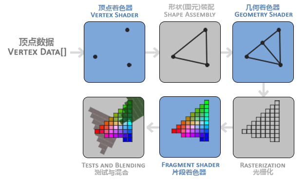

# 3D绘图基本概念

## 参考资料

- [LearnOpenGL CN](https://learnopengl-cn.github.io/)
- [OpenGL教程](https://blog.csdn.net/junzia/article/list/3)

## Vertex Array

- Android中使用ByteBuffer存储我们定义的顶点数组数据

```java
private final float vertices[] = {
    -0.5f, 0.5f, 0.0f,  // 0, Top Left
    -0.5f, -0.5f, 0.0f,  // 1, Bottom Left
    0.5f, -0.5f, 0.0f,  // 2, Bottom Right
    0.5f, 0.5f, 0.0f,  // 3, Top Right
};

private final FloatBuffer vertexBuffer;

// 每个float有4位
ByteBuffer vb = ByteBuffer.allocateDirect(vertices.length * 4);
vb.order(ByteOrder.nativeOrder());
vertexBuffer = vb.asFloatBuffer();
vertexBuffer.put(vertices);
vertexBuffer.position(0);
```

## 图形渲染管线(Graphics Pipeline)

- 图形渲染管线接受一组3D坐标，然后把它们转变为你屏幕上的有色2D像素输出。
- 图形渲染管线可以被划分为几个阶段，**每个阶段将会把前一个阶段的输出作为输入**。所有这些阶段都是高度专门化的（它们都有一个特定的函数），并且很容易并行执行。正是由于它们具有并行执行的特性，当今大多数显卡都有成千上万的小处理核心，它们在GPU上为每一个（渲染管线）阶段运行各自的小程序，从而在图形渲染管线中快速处理你的数据。**这些小程序叫做着色器(Shader)**.
- 有些着色器允许开发者自己配置，这就允许我们用自己写的着色器来替换默认的。这样我们就可以更细致地控制图形渲染管线中的特定部分了，而且因为它们运行在GPU上，所以它们可以给我们节约宝贵的CPU时间
- 下图为图形渲染管线的每个阶段的抽象展示，**蓝色部分代表的是我们可以注入自定义的着色器的部分**

- 

### Shader

- 着色器的开头总是要声明版本，接着是输入和输出变量、uniform和main函数。
- 每个着色器的入口点都是main函数，在这个函数中我们处理所有的输入变量，并将结果输出到输出变量中

```c
// 典型的着色器代码结构
#version version_number
in type in_variable_name;
in type in_variable_name;

out type out_variable_name;

uniform type uniform_name;

int main()
{
  // 处理输入并进行一些图形操作
  ...
  // 输出处理过的结果到输出变量
  out_variable_name = weird_stuff_we_processed;
}
```

### GLSL

- [GLSL语法](https://learnopengl-cn.github.io/01%20Getting%20started/05%20Shaders/)

## Vertex Shader

- 当我们谈论到顶点着色器的时候，每个输入变量也叫顶点属性(Vertex Attribute)。
- 我们能声明的顶点属性是有上限的，它一般由硬件来决定。OpenGL确保至少有16个包含4分量的顶点属性可用，但是有些硬件或许允许更多的顶点属性,可以通过以下方法查明

```java

```

- **标准化设备坐标**是一个x、y和z值在-1.0到1.0的一小段空间。**任何落在范围外的坐标都会被丢弃/裁剪，不会显示在你的屏幕上**
- **一旦顶点坐标已经在顶点着色器中处理过，它们就应该是标准化设备坐标了。**