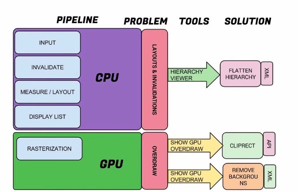

# 渲染

## Choreographer 的大体工作流程

-   Choreographer 初始化
    -   初始化 FrameHandler ，绑定 Looper
    -   初始化 FrameDisplayEventReceiver ，与 SurfaceFlinger 建立通信用于接收和请求 Vsync
    -   初始化 CallBackQueues
-   SurfaceFlinger 的 appEventThread 唤醒发送 Vsync ，Choreographer 回调
-   FrameDisplayEventReceiver.onVsync , 进入 SurfaceFlinger 的主处理函数 doFrame
-   Choreographer.doFrame 计算掉帧逻辑
-   Choreographer.doFrame 处理 Choreographer 的第一个 callback ： input
-   Choreographer.doFrame 处理 Choreographer 的第二个 callback ： animation
-   Choreographer.doFrame 处理 Choreographer 的第三个 callback ： insets animation
-   Choreographer.doFrame 处理 Choreographer 的第四个 callback ： traversal
    -   traversal-draw 中 UIThread 与 RenderThread 同步数据
-   Choreographer.doFrame 处理 Choreographer 的第五个 callback ： commit ?
-   RenderThread 处理绘制数据，真正进行渲染
-   将渲染好的 Buffer swap 给 SurfaceFlinger 进行合成

## 渲染管线

-   

### CPU

-   布局的扁平化
    -   相对布局，约束布局
    -   merge
    -   ViewStub

### GPU

-   过度绘制
    -   移除 Window 默认的 Background
    -   移除 XML 布局文件中非必需的 Background
    -   canvas.clipRect
