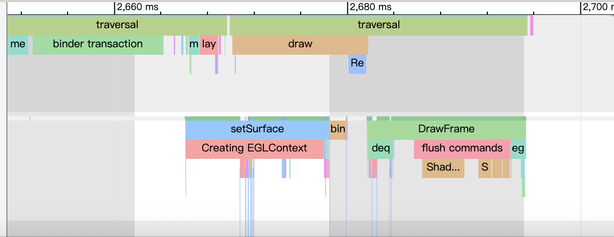

# 启动优化

## 相关文章

-   [Android 中如何计算 App 的启动时间](https://androidperformance.com/2015/12/31/How-to-calculation-android-app-lunch-time/)
-   [历时 1 年，上百万行代码！首次揭秘手淘全链路性能优化](https://mp.weixin.qq.com/s?__biz=MzAxNDEwNjk5OQ==&mid=2650403370&idx=1&sn=b4297b138eb7f73c95a6279c3458f025&chksm=83953a32b4e2b3247fc18cbee08a2682d8b09720a1c5fef0c36257ae92b1e201cb1ad3125455&mpshare=1&scene=1&srcid=#rd)

## 启动总流程

### 创建进程

-   当 APP 启动时，如果当前 app 的进程不存在，便会创建新的进程；App 主进程启动后，如果启动某个组件，并且该组件设置了 android:process 属性，组件所运行的进程不存在，也会创建新的进程。
-   **需要注意的是，如果在启动阶段，初始化的组件中，包含了多个进程，便会创建多次进程，BindApplication 操作也会重复执行多次**

### 创建 UI 线程及 Handler

-   进程创建后，会通过反射，执行 ActivityThread 入口函数,创建 Handler，并在当前线程中 prepareMainLooper,并在 Handler 中接收组件的消息，我们来看一下 Handler 中处理的消息：
    -   LAUNCH_ACTIVITY,启动，执行 Activity
    -   RESUME_ACTIVITY,恢复 Activity
    -   BIND_APPLICATION,启动 app
    -   BIND_SERVICE,Service 创建, onBind
    -   LOW_MEMORY,内存不足，回收后台程序
-   sMainThreadHandler 中，处理的消息很多，这里只罗列了，可能在启动阶段可能会执行的操作， 这些操作都是运行在 Main Thread 中，对启动而言，属于阻塞性的。Activity 生命周期，自然需要在启动阶段执行，但，对于 Service 的创建，Trim_memory 回调，广播接收等操作，就需要重点考虑，其操作耗时性。

### Activity 运行及绘制

-   前两个过程，创建进程和 UI 线程及 Handler，都是由系统决定的，对 APP 开发者而言，并不能控制其执行时间，在本阶段，执行 BindApplication,和 Acitivity 生命周期，都是可以由开发者自定义。
-   Activity 执行到 onResume 之后，会执行至 ViewRootImpl，执行两次 performTraversals,第二次 traversal 操作中，会执行 performDraw 操作，同时通知 RenderThread 线程执行绘制.
-   从启动的三个阶段，我们可以看出，启动启动时间的长短，决定因素在于，主线程中所做事情消耗的时间的多少，所以，我们的优化工作主要集中在，排查主线程中耗时性的工作，并进行合理的优化。Android 手机，系统的资源是有限的，过多的异步线程，会抢占 CPU，导致主线程执行时间片间隔增大。同样的，内存消耗状态，GC 频率，也会影响启动的时间。

## 启动时间测量

### adb 命令

```bash
adb shell am start -W com.kascend.chushou/.SplashActivity
Starting: Intent { act=android.intent.action.MAIN cat=[android.intent.category.LAUNCHER] cmp=com.kascend.chushou/.SplashActivity }
Status: ok
Activity: com.kascend.chushou/.SpashActivity
ThisTime: 1673
TotalTime: 1673
WaitTime: 1719
Complete
```

-   WaitTime 就是总的耗时，包括前一个应用 Activity pause 的时间和新应用启动的时间；
-   ThisTime 表示一连串启动 Activity 的最后一个 Activity 的启动耗时；
-   TotalTime 表示新应用启动的耗时，包括新进程的启动和 Activity 的启动，但不包括前一个应用 Activity pause 的耗时
-   系统在绘制完成后，ActivityManagerService 会回调该方法,统计时间不如 SysTrace 准确，但是能够方便我们通过脚本多次启动测量 TotalTime,对比版本间启动时间差异。

### logcat 文件

-   

### SystemTrace

#### bindApplication 到第二次 traversal 完成之间的时间

-   
-   第一次 traversal 时会创建 Creating EGLContext,并没有真正的 dequeueBuffer, flush Commands,eglSwapBuffersWithDamageKHR， 所以实际是没有真正渲染出来的

#### system_server 中的 launching time

-   system_server 中找到 launch 对应 package 的名字，按 M 键
-   

## 网络优化

### 阶段

-   发送处理阶段：网络库 bindService 影响前 x 个请求，图片并发限制图片库线程排队。
-   网络耗时：部分请求响应 size 大，包括 SO 文件，Cache 资源，图片原图大尺寸等。
-   返回处理：个别数据网关请求 json 串复杂解析严重耗时（3s）,且历史线程排队设计不合适。
-   上屏阻塞：回调 UI 线程被阻，反映主线程卡顿严重。高端机达 1s，低端机恶化达 3s 以上。
-   回调阻塞：部分业务回调执行耗时，阻塞主线程或回调线程

### 优化

-   多次重复的请求，业务方务必收敛请求次数，减少非必须请求。
-   数据大的请求如资源文件、so 文件，非启动必须统一延后或取消。
-   业务方回调执行阻塞主线程耗时过长整改。我们知道，肉眼可见流畅运行，需要运行 60 帧/秒， 意味着每帧的处理时间不超过 16ms。针对主线程执行回调超过 16ms 的业务方，推动主线程执行优化。
-   协议 json 串过于复杂导致解析耗时严重，网络并发线程数有限，解析耗时过长意味着请求长时间占用 MTOP 线程影响其他关键请求执行。推动业务方 handler 注入使用自己的线程解析或简化 json 串

## 优化方式

### 业务梳理

-   我们首先需要梳理清楚当前启动过程正在运行的每一个模块，哪些是一定需要的、哪些可以砍掉、哪些可以懒加载
-   懒加载要防止集中化，否则容易出现首页显示后用户无法操作的情形
-   业务梳理

### 闪屏优化

### 线程优化

-   线程的优化一方面是控制线程数量，线程数量太多会相互竞争 CPU 资源，因此要有统一的线程池，并且根据机器性能来控制数量
-   另一方面是检查线程间的锁，通过 systrace 可以看到锁等待的事件，我们需要排查这些等待是否可以优化，特别是防止主线程出现长时间的空转

### 系统调用优化

-   不做系统调用，比如 PackageManagerService 操作、Binder 调用
-   不要过早地拉起应用的其他进程
-   不要启动 Activity 以外的其它组件

### GC 优化

-   避免进行大量的字符串操作，特别是序列化和反序列化
-   频繁创建的对象需要考虑复用

### 重排

-   类重排
-   资源重排， IO 优化

### 主页面布局优化

### IdleHandler

### APK 瘦身

### 网络链路优化

-   发送处理阶段：网络库 bindService 影响前 x 个请求，图片并发限制图片库线程排队
-   网络耗时：部分请求响应 size 大，包括 SO 文件，Cache 资源，图片原图大尺寸等
-   返回处理：个别数据网关请求 json 串复杂解析严重耗时（3s）,且历史线程排队设计不合适
-   上屏阻塞：回调 UI 线程被阻，反映主线程卡顿严重。高端机达 1s，低端机恶化达 3s 以上
-   回调阻塞：部分业务回调执行耗时，阻塞主线程或回调线程

#### 具体网络优化

-   多次重复的请求，业务方务必收敛请求次数，减少非必须请求。
-   数据大的请求如资源文件、so 文件，非启动必须统一延后或取消。
-   业务方回调执行阻塞主线程耗时过长整改。我们知道，肉眼可见流畅运行，需要运行 60 帧/秒， 意味着每帧的处理时间不超过 16ms。针对主线程执行回调超过 16ms 的业务方，推动主线程执行优化。
-   协议 json 串过于复杂导致解析耗时严重，网络并发线程数有限，解析耗时过长意味着请求长时间占用 MTOP 线程影响其他关键请求执行。推动业务方 handler 注入使用自己的线程解析或简化 json 串。

### 业务优化

-   数据库及 IO 操作都移到工作线程，并且设置线程优先级为 THREAD_PRIORITY_BACKGROUND，这样工作线程最多能获取到 10%的时间片，优先保证主线程执行
-   流程梳理，延后执行；实际上，这一步对项目启动加速最有效果。通过流程梳理发现部分流程调用时机偏失等， 例如
    -   更新等操作无需在首屏尚未展示就调用，造成资源竞争
    -   自有统计在 Application 的调用里创建数量固定为 5 的线程池，造成资源竞争
    -   修改广告闪屏逻辑为下次生效
-   去掉无用但被执行的老代码
-   去掉开发阶段使用但线上未被执行的代码
-   去掉重复逻辑执行代码
-   去掉调用三方 SDK 里或者 Demo 里的多余代码
-   信息缓存，常用信息只在第一次获取，之后从缓存中取
-   项目是多进程架构，只在主进程执行 Application 的 onCreate()
