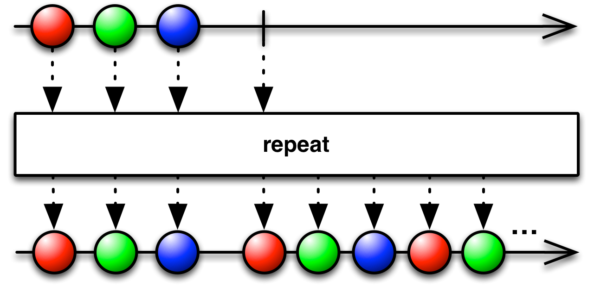
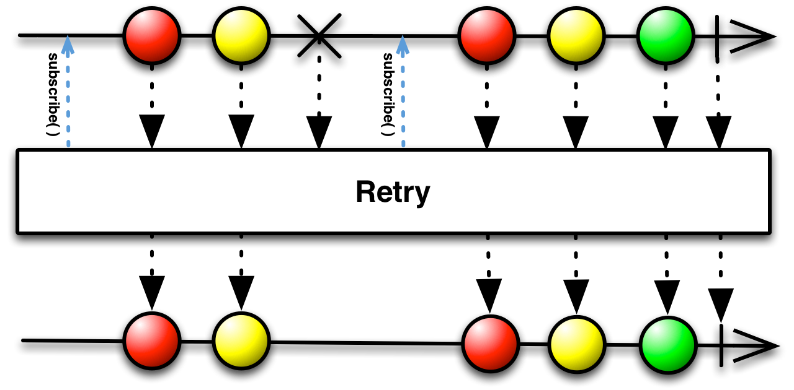

# 创建事件流

- [create](#create)
- [defer](#defer)
- [empty](#empty)
- [never](#never)
- [error](#error)
- [from](#from)
- [just](#just)
- [range](#range)
- [interval](#interval)
- [intervalRange](#intervalrange)
- [timer](#timer)
- [Repeat](#repeat)
- [RepeatWhen 与RetryWhen](#repeatwhen-与retrywhen)

## create

- Observable.create, 与subject 相比，数据源被封装起来了，并和不相关的代码隔离开了。
- 其次：Subject 有一些不太明显的问题，通过使用 Subject 你自己在管理状态，并且任何访问该 Subject 对象的人都可以往里面发送数据然后改变事件流，
 使用 create 创建的 Observable，当 Observable 创建的时候，你的函数还没有执行，只有当有 Subscriber 订阅的时候才执行。
 这就意味着每次当有 Subscriber 订阅的时候，该函数就执行一次。和 defer 的功能类似

## defer

```java
// Rxjava2
public static <T> Flowable<T> defer(Callable<? extends Publisher<? extends T>> supplier)
```

- Flowable.defer， defer 的参数是一个返回一个 Flowable 对象的工厂函数。
- 该函数返回的 Flowable 对象就是 defer 返回的 Flowable 对象。
- **重点是，每当一个新的 Subscriber 订阅的时候，这个函数就重新执行一次**。

```java
Flowable<Long>  now  =  Flowable.just(System.currentTimeMillis());
now.subscribe(System.out::println);
Thread.sleep(1000);
now.subscribe(System.out::println);

1431443908375
1431443908375

Flowable<Long> now = Flowable.defer(() ->
        FlowableF.just(System.currentTimeMillis()));
now.subscribe(System.out::println);
Thread.sleep(1000);
now.subscribe(System.out::println);

1431444107854
1431444108858

```

## empty

- Observable.empty， 这个函数创建的 Observable 只发射一个 onCompleted 事件就结束了。

## never

- Observable.never， 这个 Observable 将不会发射任何事件和数据

## error

- Observable.error， 这个 Observable 将会发射一个 error 事件，然后结束

## from

```java
// Rxjava2
public static <T> Observable<T> fromArray(T... items)
public static <T> Observable<T> fromCallable(Callable<? extends T> supplier)
public static <T> Observable<T> fromFuture(Future<? extends T> future)
public static <T> Observable<T> fromFuture(Future<? extends T> future, Scheduler scheduler)
public static <T> Observable<T> fromFuture(Future<? extends T> future, long timeout, TimeUnit unit)
public static <T> Observable<T> fromFuture(Future<? extends T> future, long timeout, TimeUnit unit, Scheduler scheduler)
public static <T> Observable<T> fromIterable(Iterable<? extends T> source)
public static <T> Observable<T> fromPublisher(Publisher<? extends T> publisher)
```

- rxjava2，与rxjava1不同的是，**如果cancel由fromFuturen创建的Flowable,并不会cancel Future**， 解决办法是
 调用doOnCancel，然后取消Future.

```java
// 解决办法是调用doOnCanel中调用futuren的cancel
Future<String> future = ...;
Flowable<String> flowable = Flowable.fromFuture(future)
            .doOnCancel(() -> future.cancel(true));
```

## just

- Observable.just， just 函数创建一个发射预定义好的数据的 Observable ，发射完这些数据后，事件流就结束了

```java
Observable<String> values = Observable.just("one", "two", "three");
Subscription subscription = values.subscribe(
    v -> System.out.println("Received: " + v),
    e -> System.out.println("Error: " + e),
    () -> System.out.println("Completed")
);

Received:  one
Received:  two
Received:  three
Completed
```

## range

- Observable.range， 该函数发射一个整数序列

```java
Observable<Integer>  values  =  Observable.range(10,  15);
```

## interval

- Observable.interval， 创建一个无限的计时序列，每隔一段时间发射一个数字，从 0 开始
- 下面这个序列如果我们不调用 unsubscribe 的话，这个序列是不会停止的。

```java
Observable<Long> values = Observable.interval(1000, TimeUnit.MILLISECONDS);
Subscription subscription = values.subscribe(
    v -> System.out.println("Received: " + v),
    e -> System.out.println("Error: " + e),
    () -> System.out.println("Completed")
);
System.in.read();

3
4
5
6

Received: 0
Received: 1
Received: 2
Received: 3
...
```

## intervalRange

```java
 public static Observable<Long> intervalRange(long start, long count,
                long initialDelay, long period,
                TimeUnit unit, Scheduler scheduler)
```

## timer

```java
public static Flowable<Long> timer(long delay, TimeUnit unit)
public static Flowable<Long> timer(long delay, TimeUnit unit, Scheduler scheduler)
```

- **间隔一段时间，发送一个0L,然后发送一个onComlete**

## Repeat



```java
public final Flowable<T> repeat()
public final Flowable<T> repeat(long times)
// 重复发送原publisher发送的数据，直到stop返回true才终止
public final Flowable<T> repeatUntil(BooleanSupplier stop)
```

- 创建一个发射特定数据重复多次的Observable,**原始的publish并没有重复发送数据**
- 它不是创建一个Observable，而是重复发射原始Observable的数据序列，这个序列或者是无限的，或者通过repeat(n)指定重复次数

## Retry



- 如果原始Observable遇到错误，重新订阅它期望它能正常终止
- Retry操作符不会将原始Observable的onError通知传递给观察者，它会订阅这个Observable，再给它一次机会无错误地完成它的数据序列。
- **Retry总是传递onNext通知给观察者，由于重新订阅，可能会造成数据项重复**

## RepeatWhen 与RetryWhen

- 当repeat()接收到onCompleted()事件后触发重订阅, 重新发送源publisher发送的数据
- 当retry()接收到onError()事件后触发重订阅。

```java
public final Flowable<T> repeatWhen(final Function<? super Flowable<Object>, ? extends Publisher<?>> handler)
public final Flowable<T> retryWhen(final Function<? super Flowable<Throwable>, ? extends Publisher<?>> handler)
```

- retryWhen和retry类似，区别是，retryWhen将onError中的Throwable传递给handler，这个函数产生另一个Observable，retryWhen观察它的结果再决定是不是要重新订阅原始的Observable。如果这个Observable发射了一项数据，它就重新订阅，如果这个Observable发射的是onError通知，它就将这个通知传递给观察者然后终止。