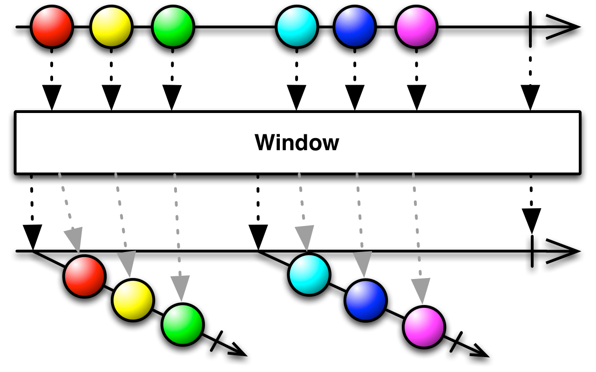
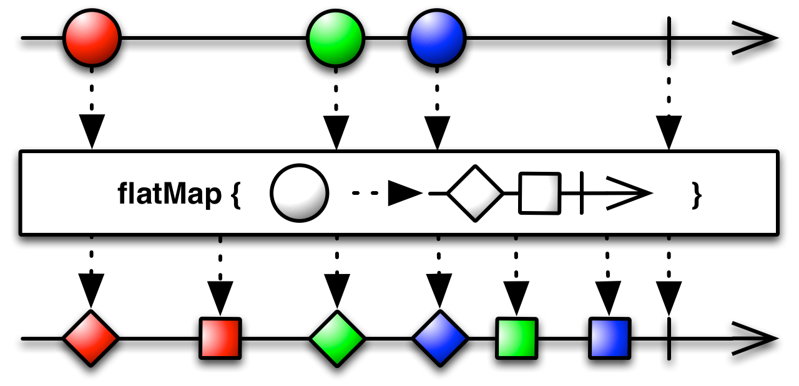
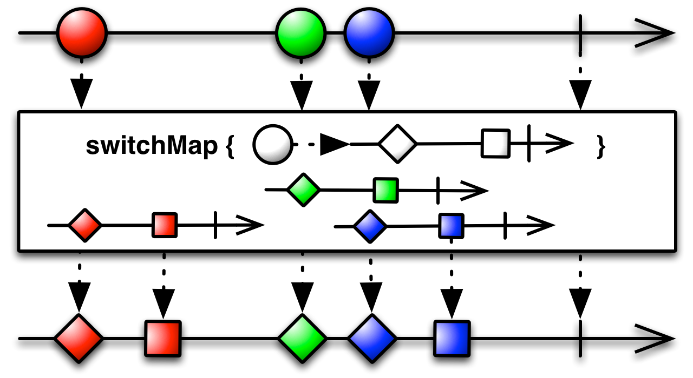

# 数据转换

- [buffer 与 window](#buffer-与-window)
- [map](#map)
- [flatmap, concatMap, switchMap](#flatmap-concatmap-switchmap)
    - [flatMap 与 concatMap](#flatmap-与-concatmap)
    - [switchMap](#switchmap)
- [cast 与ofType](#cast-与oftype)
- [groupBy](#groupby)
- [timestamp 与timeinterval](#timestamp-与timeinterval)
- [materialize与dematerialize](#materialize与dematerialize)

## buffer 与 window

[buffer](https://mcxiaoke.gitbooks.io/rxdocs/content/operators/Buffer.html)

```java
// 将收集的数据放到一个list里在， list最多保存count个数据，然后发射这个list, 
// 然后创建新的list,等待新的数据缓存后发射
// 最后一项可能不足count项
public final Flowable<List<T>> buffer(int count)
public final Flowable<Flowable<T>> window(long count)
```




- buff定期收集Observable的数据放进一个集合内，然后发射这些集合，而不是一次发射一个值

- **Window和Buffer类似，但不是发射来自原始Observable的数据包，它发射的是Observables**，
 这些Observables中的每一个都发射原始Observable数据的一个子集，最后发射一个onCompleted通知

## map

- map 使用一个转换的函数参数把源Observable 中的数据转换为另外一种类型的数据。返回的 Observable 中包含了转换后的数据

```java
public final <R> Flowable<R> map(Function<? super T, ? extends R> mapper)
```

## flatmap, concatMap, switchMap

### flatMap 与 concatMap

```java
public final <R> Flowable<R> flatMap(Function<? super T, ? extends Publisher<? extends R>> mapper)
```



```java
public final <R> Flowable<R> concatMap(Function<? super T, ? extends Publisher<? extends R>> mapper)
```


- 首先，FlatMap和ConcatMap操作符使用指定的函数mapper对原始Publisher发射的每一项数据执行变换操作，这个函数返回一个本身也发射数据的Publisher
- 然后，**FlatMap合并这些Publisher发射的数据**,合并后的数据有可能数据顺序与Publish生成的顺序不一致了
  而**concatMap则按次序连接这些Publisher发射的数据**，发射的数据肯定是一个publish发送完后，才会有下一个publish发送的数据
- 最后将合并后的结果当做它自己的数据序列发射

### switchMap

```java
public final <R> Flowable<R> switchMap(Function<? super T, ? extends Publisher<? extends R>> mapper)
```



- 功能与flatMa类似，当原始Publisher发射一个新的数据时，它将取消订阅并停止监视之前那个数据的Observable，只监视当前这一个

## cast 与ofType

- cast 是把一个对象强制转换为子类型的缩写形式。
- 如果遇到类型不一样的对象的话，就会抛出一个 error
- 如果你不想处理类型不一样的对象，则可以用 ofType 。 该函数用来判断数据是否为该类型，如果不是则跳过这个数据

```java
Observable<Object> values = Observable.just(0, 1, 2, 3);
 // 我们知道其中的参数为Integer,强制转换
values
    .cast(Integer.class)
    .subscribe(new PrintSubscriber("Map"));

Observable<Object> values = Observable.just(0, 1, "2", 3);
// 忽略了"2",因为它不是Integer类型的
values
    .ofType(Integer.class)
    .subscribe(new PrintSubscriber("Map"));
```

## groupBy

- GroupBy操作符将原始Observable分拆为一些Observables集合，它们中的每一个发射原始Observable数据序列的一个子序列。
- 哪个数据项由哪一个Observable发射是由一个函数keySelector判定的，这个函数给每一项指定一个Key，Key相同的数据会被同一个Observable发射
- groupBy将原始Observable分解为一个发射多个GroupedObservable的Observable，一旦有订阅，每个GroupedObservable就开始缓存数据。
- 因此，**如果你忽略这些GroupedObservable中的任何一个，这个缓存可能形成一个潜在的内存泄露**。
- 因此，**如果你不想观察，也不要忽略GroupedObservable。你应该使用像take(0)这样会丢弃自己的缓存的操作符**
- 如果你取消订阅一个GroupedObservable，那个Observable将会终止。如果之后原始的Observable又发射了一个与这个Observable的Key匹配的数据，
 **groupBy将会为这个Key创建一个新的GroupedObservable**

```java
public final <K> Flowable<GroupedFlowable<K, T>> groupBy(Function<? super T, ? extends K> keySelector)
public final <K, V> Flowable<GroupedFlowable<K, V>> groupBy(Function<? super T, ? extends K> keySelector,
            Function<? super T, ? extends V> valueSelector,
            boolean delayError, int bufferSize)
```

## timestamp 与timeinterval

```java
public final Flowable<Timed<T>> timeInterval()
public final Flowable<Timed<T>> timestamp()

public final class Timed<T> {
    final T value;
    final long time;
    final TimeUnit unit;
}
```

- 这两个函数可以给数据流中的数据添加额外的时间相关的信息。
- **timestamp 把数据转换为 Timed 类型，里面包含了原始的数据和一个原始数据是何时发射的时间戳**
- **timeInterval 函数记录了前一个数据和当前数据发射之间的时间间隔**
- 这两个函数中的时间对于记录日志和调试程序是非常有用的

```java
Observable<Long> values = Observable.interval(100, TimeUnit.MILLISECONDS);

values.take(3)
    .timestamp()
    .subscribe(new PrintSubscriber("Timestamp"));

Timestamp: Timestamped(timestampMillis = 1428611094943, value = 0)
Timestamp: Timestamped(timestampMillis = 1428611095037, value = 1)
Timestamp: Timestamped(timestampMillis = 1428611095136, value = 2)
Timestamp: Completed

Observable<Long> values = Observable.interval(100, TimeUnit.MILLISECONDS);
values.take(3)
    .timeInterval()
    .subscribe(new PrintSubscriber("TimeInterval"));

TimeInterval: TimeInterval [intervalInMilliseconds=131, value=0]
TimeInterval: TimeInterval [intervalInMilliseconds=75, value=1]
TimeInterval: TimeInterval [intervalInMilliseconds=100, value=2]
TimeInterval: Completed
```

## materialize与dematerialize

- materialize 对于记录日志也是很有用的。materialize 把数据转换为元数据发射出去
- dematerialize 函数会把 materialize 转换后的Observable 再还原为 源 Observable
- 元数据中包含了源 Observable 所发射的动作，是调用 onNext 还是 onComplete。注意上图中，源 Observable 结束的时候， materialize 还会发射一个 onComplete 数据，然后才发射一个结束事件

```java
Observable<Long> values = Observable.interval(100, TimeUnit.MILLISECONDS);

values.take(3)
    .materialize()
    .subscribe(new PrintSubscriber("Materialize"));

Materialize: [rx.Notification@a4c802e9 OnNext 0]
Materialize: [rx.Notification@a4c802ea OnNext 1]
Materialize: [rx.Notification@a4c802eb OnNext 2]
Materialize: [rx.Notification@18d48ace OnCompleted]
Materialize: Completed
```

但是由不同的原Observable产生的数据的顺序可能与原Observable会不一样