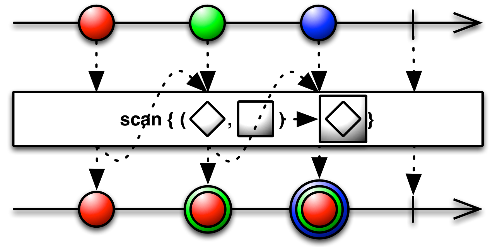

# 事件流之聚合

- [count](#count)
- [scan 与 reduce](#scan-与-reduce)
    - [scan](#scan)
    - [reduce](#reduce)
- [groupBy](#groupby)
- [nest](#nest)
- [数据的收集](#数据的收集)
    - [collect](#collect)
    - [toList](#tolist)
    - [toSortedList](#tosortedlist)
    - [toMap](#tomap)
    - [toMultimap](#tomultimap)

## count

```java
public final Single<Long> count()
```

- count 函数和 Java 集合中的 size 或者 length 一样。用来统计源 Observable 完成的时候一共发射了多少个数据

```java
Observable<Integer> values = Observable.range(0, 3);
values.subscribe(new PrintSubscriber("Values"));
values.count().subscribe(new PrintSubscriber("Count"));

```

## scan 与 reduce

### scan



```java
public final Flowable<T> scan(BiFunction<T, T, T> accumulator)
public final <R> Flowable<R> scan(final R initialValue, BiFunction<R, ? super T, R> accumulator)
public final <R> Flowable<R> scanWith(Callable<R> seedSupplier, BiFunction<R, ? super T, R> accumulator)
```

- Scan操作符对原始Publisher发射的第一项数据应用一个函数，然后将那个函数的结果作为自己的第一项数据发射。
- 它将函数的结果同第二项数据作为参数调用该函数，然后发射结果
- 持续进行这个过程来产生剩余的数据序列.

```java
Flowable<Integer> flowable = Flowable.just(1,2,3,4,5);
flowable.scan((v1, v2) -> v1 + v2).subscribe(System.out::println);

// output
1
3
6
10
15
```

### reduce

- 共scan类似，使用从数据流中第一个数据到最后一个数据（从左往右）中的数据来调用 参数 accumulator ，
 accumulator 用前一次返回的结果和下一个数据来再次调用 accumulator 。
- **相比较于scan，不会发射中间的数据**

```java
 public final Maybe<T> reduce(BiFunction<T, T, T> reducer)
 public final <R> Single<R> reduce(R seed, BiFunction<R, ? super T, R> reducer)
 public final <R> Single<R> reduceWith(Callable<R> seedSupplier, BiFunction<R, ? super T, R> reducer)
```

```java
Flowable<Integer> flowable = Flowable.just(1,2,3,4,5);
flowable.reduce((v1, v2) -> v1 + v2) .subscribe(System.out::println);

// output
15
```

## groupBy

- groupBy 是 toMultimap 函数的 Rx 方式的实现。groupBy 根据每个源Observable 发射的值来计算一个 key， 然后为每个 key 创建一个新的 Observable并把key 一样的值发射到对应的新 Observable 中。
- 返回的结果为 GroupedObservable。 每次发现一个新的key，内部就生成一个新的 GroupedObservable并发射出来。和普通的 Observable 相比 多了一个 getKey 函数来获取 分组的 key。来自于源Observable中的值会被发射到对应 key 的 GroupedObservable 中

```java
Observable<String> values = Observable.just(
        "first",
        "second",
        "third",
        "forth",
        "fifth",
        "sixth"
);

values.groupBy(word -> word.charAt(0))
    .subscribe(
        group -> group.last()
            .subscribe(v -> System.out.println(group.getKey() + ": " + v))
    );

s: sixth
t: third
f: fifth

```

## 数据的转换

### to

```java
public final <R> R to(Function<? super Flowable<T>, R> converter)
```

### toFuture

```java
public final Future<T> toFuture()
```

- 如果源publish发射超过1个元素，throw IllegalArgumentException
- 如果源publish没有元素，throw NoSuchElemntException

- 如果源publish发射1个元素，但是还是要转为Future，应当使用

```java
flowable.toList().toBlocking().toFuture();
```

### toObservable

```java
public final Observable<T> toObservable()
```

- 实际上是将支持背压Publisher变为不支持背压的Publisher，发射的实际上相当于Flowable调用了request(Long.MAX_VALUE)

## 数据的收集

### toList

```java
public final Single<List<T>> toList()
public final <U extends Collection<? super T>> Single<U> toList(Callable<U> collectionSupplier)
```

- 将Observable中的数据转换为一个list
- 注意如果源发射的数据量很大或都是无限的，不应当使用这个操作符

```java
Flowable<Integer> values = Flowable.range(10,5);

values
    .toList()
    .subscribe(v -> System.out.println(v));

```

### toSortedList

```java
 public final Single<List<T>> toSortedList(final Comparator<? super T> comparator, int capacityHint)
```

- toSortedList 和toList类似，返回一个排序后的 list

```java
public final Observable<java.util.List<T>> toSortedList()
public final Observable<java.util.List<T>> toSortedList(
    Func2<? super T,? super T,java.lang.Integer> sortFunction)
```

### toMap

```java
public final <K> Single<Map<K, T>> toMap(final Function<? super T, ? extends K> keySelector)
public final <K, V> Single<Map<K, V>> toMap(final Function<? super T, ? extends K> keySelector,
    final Function<? super T, ? extends V> valueSelector)
public final <K, V> Single<Map<K, V>> toMap(final Function<? super T, ? extends K> keySelector,
            final Function<? super T, ? extends V> valueSelector,
            final Callable<? extends Map<K, V>> mapSupplier)
```

- 对于源publish发射的值value, 由keySelector生成key,(key, value)插入到map中
- **如果有多个value生成的key一样，那么map中key对应的value是最后那一个**

### toMultimap

```java
public final <K> Single<Map<K, Collection<T>>> toMultimap(Function<? super T, ? extends K> keySelector)
public final <K, V> Single<Map<K, Collection<V>>> toMultimap(Function<? super T, ? extends K> keySelector, 
        Function<? super T, ? extends V> valueSelector)
public final <K, V> Single<Map<K, Collection<V>>> toMultimap(
            final Function<? super T, ? extends K> keySelector,
            final Function<? super T, ? extends V> valueSelector,
            final Callable<? extends Map<K, Collection<V>>> mapSupplier,
            final Function<? super K, ? extends Collection<? super V>> collectionFactory)
```

- 通常情况下多个 value 的 key 可能是一样的。 一个 key 可以映射多个 value 的数据结构为 multimap，multimap 的 value 为一个集合。该过程被称之为 “grouping” （分组）

```java
Observable<Person> values = Observable.just(
    new Person("Will", 35),
    new Person("Nick", 40),
    new Person("Saul", 35)
);

values
    .toMultimap(
        person -> person.age,
        person -> person.name)
    .subscribe(new PrintSubscriber("toMap"));

toMap: {35=[Will, Saul], 40=[Nick]}
toMap: Completed

```
