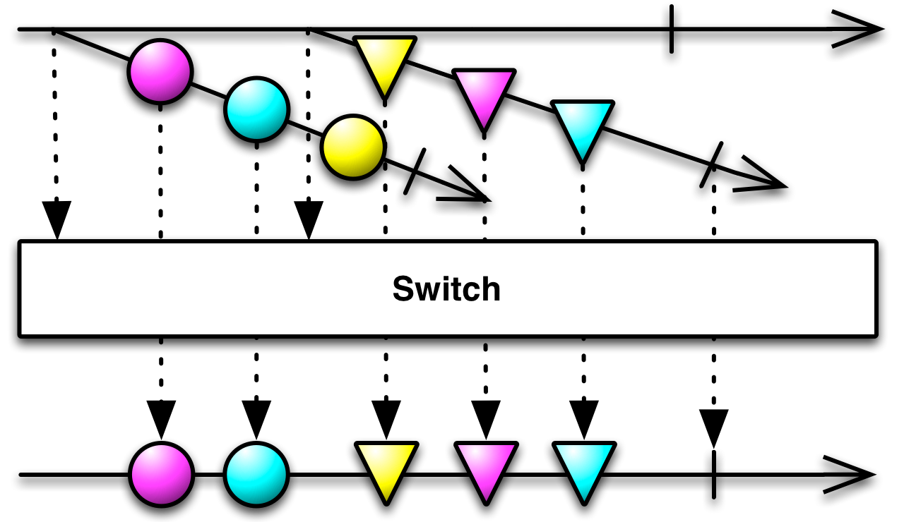
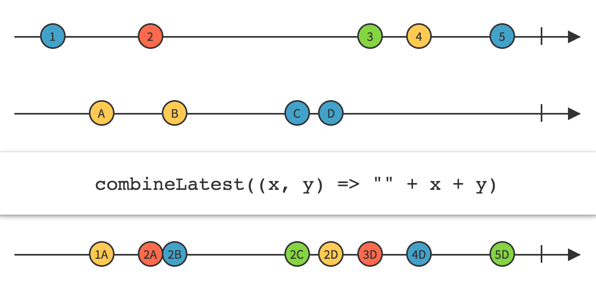

# 组合

- [concat](#concat)
- [startWith](#startwith)
- [merge](#merge)
- [switch](#switch)
- [zip](#zip)
- [combineLatest](#combinelatest)
- [join](#join)

## concat


```java
public static <T> Flowable<T> concat(Iterable<? extends Publisher<? extends T>> sources)
public static <T> Flowable<T> concat(Publisher<? extends Publisher<? extends T>> sources)
public static <T> Flowable<T> concatArray(Publisher<? extends T>... sources)
```

- Concat操作符连接多个Observable的输出，就好像它们是一个Observable，第一个Observable发射的所有数据在第二个Observable发射的任何数据前面，以此类推
- **Concat不会让数据交错**

## startWith


```java
// startWith内部，实际上是调用concat实现的
public final Flowable<T> startWith(T value)

public final Flowable<T> startWith(Iterable<? extends T> items) {
    return concatArray(fromIterable(items), this);
}

public final Flowable<T> startWith(Publisher<? extends T> other)

```

- 在数据序列的开头插入一条指定的项
- **如果你想要一个Observable在发射数据之前先发射一个指定的数据序列，可以使用StartWith操作符**。
- **如果你想一个Observable发射的数据末尾追加一个数据序列可以使用Concat操作符**。

## merge

- 与concat类似，使用Merge操作符你可以将多个Observables的输出合并，就好像它们是一个单个的Observable一样
- **Merge可能会让合并的Observables发射的数据交错**，也就是数据可能不是按顺序发射的

## switch



- 将一个发射多个Observables的Observable转换成另一个单独的Observable，后者发射那些Observables最近发射的数据项
- **实际上concat，merge，switch 与concatMap,FlatMap,SwitchMap类**

## zip


```java
public static <T, R> Flowable<R> zip(Iterable<? extends Publisher<? extends T>> sources,
            final Function<? super Object[], ? extends R> zipper)
public static <T, R> Flowable<R> zip(Publisher<? extends Publisher<? extends T>> sources,
            final Function<? super Object[], ? extends R> zipper)
```

- Zip操作符返回一个Obversable，它使用函数zipper按顺序结合两个或多个Observables发射的数据项，然后它发射这个函数返回的结果。
- **它按照严格的顺序应用这个函数,也就是说只有当每个Observable都发射了第一个数据后，才使用函数生第一个结果**，对每个Observable都发射了第二个数据使用函数生成第二个结果，并且依次类推
- **它只发射与发射数据项最少的那个Observable一样多的数据**。

## combineLatest



```java
public static <T, R> Flowable<R> combineLatest(Function<? super Object[], ? extends R> combiner,
        Publisher<? extends T>... sources)
public static <T, R> Flowable<R> combineLatest(Iterable<? extends Publisher<? extends T>> sources,
            Function<? super Object[], ? extends R> combiner)
```

- CombineLatest操作符行为类似于zip，但是**只有当原始的Observable中的每一个都发射了一条数据时zip才发射数据**。
- CombineLatest则在原始的Observable中任意一个发射了数据时,使用一个函数结合它们最近发射的数据，然后发射这个函数的返回值
- 也就是原来Observalbes中任意一个发射了数据，都将这个数据与其它的observable最近发射的数据结合，然后发射这个值

## join


- 任何时候，只要在另一个Observable发射的数据定义的时间窗口内，这个Observable发射了一条数据，就结合两个Observable发射的数据

### 参数解析

- join(Observable, Func1, Func1, Func2)我们先介绍下join操作符的4个参数：
    - Observable：源Observable需要组合的Observable,这里我们姑且称之为目标Observable；
    - Func1：接收从源Observable发射来的数据，并返回一个Observable，这个Observable的声明周期决定了源Obsrvable发射出来的数据的有效期；
    - Func1：接收目标Observable发射来的数据，并返回一个Observable，这个Observable的声明周期决定了目标Obsrvable发射出来的数据的有效期；
    - Func2：接收从源Observable和目标Observable发射出来的数据，并将这两个数据组合后返回。

- 所以Join操作符的语法结构大致是这样的：onservableA.join(observableB, 控制observableA发射数据有效期的函数， 控制observableB发射数据有效期的函数，两个observable发射数据的合并规则)

### 合并原理

- join操作符的效果类似于排列组合，把第一个数据源A作为基座窗口，他根据自己的节奏不断发射数据元素
- 第二个数据源B，每发射一个数据，我们都把它和第一个数据源A中已经发射的数据进行一对一匹配
- 举例来说，如果某一时刻B发射了一个数据“B”,此时A已经发射了0，1，2，3共四个数据，并且B的时间窗口内与A中的1,2有交集,那么我们的合并操作就会把“B”依次与1,2配对，得到四组数据： [1, B] [2, B]