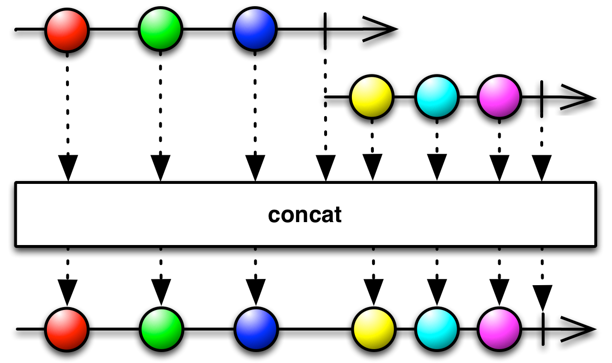

# 组合

## concat



```java
public static <T> Flowable<T> concat(Iterable<? extends Publisher<? extends T>> sources)
public static <T> Flowable<T> concat(Publisher<? extends Publisher<? extends T>> sources)
public static <T> Flowable<T> concatArray(Publisher<? extends T>... sources)
```

- Concat操作符连接多个Observable的输出，就好像它们是一个Observable，第一个Observable发射的所有数据在第二个Observable发射的任何数据前面，以此类推
- **Concat不会让数据交错**

## startWith


```java
// startWith内部，实际上是调用concat实现的
public final Flowable<T> startWith(T value)

public final Flowable<T> startWith(Iterable<? extends T> items) {
    return concatArray(fromIterable(items), this);
}

public final Flowable<T> startWith(Publisher<? extends T> other)

```

- 在数据序列的开头插入一条指定的项
- **如果你想要一个Observable在发射数据之前先发射一个指定的数据序列，可以使用StartWith操作符**。
- **如果你想一个Observable发射的数据末尾追加一个数据序列可以使用Concat操作符**。

## merge

- 与concat类似，使用Merge操作符你可以将多个Observables的输出合并，就好像它们是一个单个的Observable一样
- **Merge可能会让合并的Observables发射的数据交错**，也就是数据可能不是按顺序发射的

## switch


- 将一个发射多个Observables的Observable转换成另一个单独的Observable，后者发射那些Observables最近发射的数据项
- **实际上concat，merge，switch 与concatMap,FlatMap,SwitchMap类**

## join