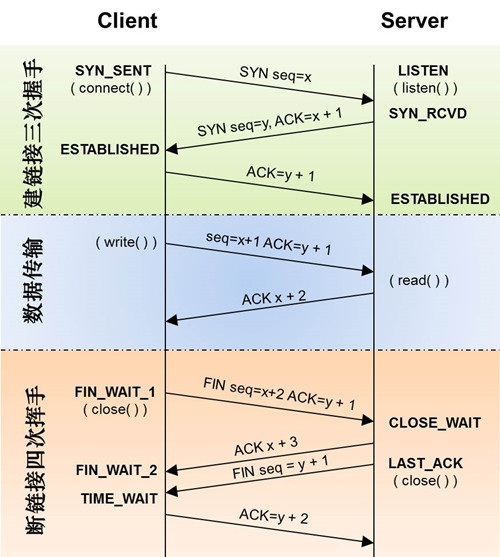

# Okhttp

## 相关文章

- [Android网络编程（八）源码解析OkHttp后篇[复用连接池]](https://blog.csdn.net/itachi85/article/details/52335403)

## 三次握手，四次挥手

- 

### 三次握手

- 第一次握手：建立连接。客户端发送连接请求报文段，将SYN位置为1，Sequence Number为x；然后，客户端进入SYN_SEND状态，等待服务器的确认；
- 第二次握手：服务器收到客户端的SYN报文段，需要对这个SYN报文段进行确认，设置Acknowledgment Number为x+1(Sequence Number+1)；同时，自己自己还要发送SYN请求信息，将SYN位置为1，Sequence Number为y；服务器端将上述所有信息放到一个报文段（即SYN+ACK报文段）中，一并发送给客户端，此时服务器进入SYN_RECV状态；
- 第三次握手：客户端收到服务器的SYN+ACK报文段。然后将Acknowledgment Number设置为y+1，向服务器发送ACK报文段，这个报文段发送完毕以后，客户端和服务器端都进入ESTABLISHED状态，完成TCP三次握手。

### 四次挥手

- 第一次挥手：主机1（可以使客户端，也可以是服务器端），设置Sequence Number和Acknowledgment Number，向主机2发送一个FIN报文段；此时，主机1进入FIN_WAIT_1状态；这表示主机1没有数据要发送给主机2了；
- 第二次挥手：主机2收到了主机1发送的FIN报文段，向主机1回一个ACK报文段，Acknowledgment Number为Sequence
- 第三次挥手：主机2向主机1发送FIN报文段，请求关闭连接，同时主机2进入LAST_ACK状态；
- 第四次挥手：主机1收到主机2发送的FIN报文段，向主机2发送ACK报文段，然后主机1进入TIME_WAIT状态；主机2收到主机1的ACK报文段以后，就关闭连接；此时，主机1等待2MSL后依然没有收到回复，则证明Server端已正常关闭，那好，主机1也可以关闭连接了。

## 连接池

- 原理是KeepAlive的连接
- ConnectionPool，最多保持5个空闲的连接，每个连接最多保留5分钟
- 使用类似引用计算来看判断连接是否正在使用
- 

## addInterceptor 和 addNetworkInterceptor

- 

- [Okhttp 的addInterceptor 和 addNetworkInterceptor 的区别](https://blog.csdn.net/OneDeveloper/article/details/88381817)
- [Okhttp-wiki 之 Interceptors 拦截器](https://www.jianshu.com/p/2710ed1e6b48)

## Websocket
