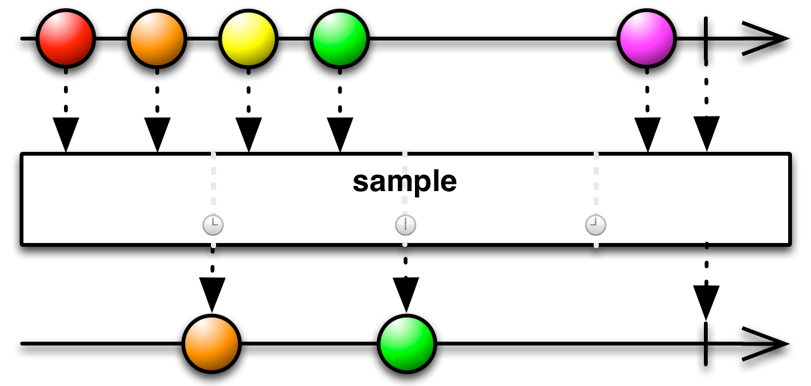

# 过滤数据

* [filter](#filter)
* [去重](#去重)
  * [distinct](#distinct)
  * [distinctUntilChanged](#distinctuntilchanged)
* [特定位置](#特定位置)
  * [first](#first)
  * [elementAt](#elementat)
  * [last](#last)
* [single](#single)
* [skip元素](#skip元素)
* [take](#take)
* [ignoreElements](#ignoreelements)
* [sample与ThrottleLast](#sample与throttlelast)
* [throttleFirst](#throttlefirst)
* [debounce与throttleWithTimeOut](#debounce与throttlewithtimeout)

* 所有的操作符都返回一个不影响前一个 Observable 的新 Observable 。 整个 Rx 框架都遵守该原则。通过创建新的 Observable 来转换之前的 Observable而不会对之前的 Observable 造成干扰。订阅到初始 Observable 的 Subscribers 不会受到任何影响，但是在后面的章节中也会看到，开发者也需要当心该原则

## filter

* filter 函数使用一个 predicate 函数接口来判断每个发射的值是否能通过这个判断

```java
Observable<Integer> values = Observable.range(0,10);
Subscription oddNumbers = values
    .filter(v -> v % 2 == 0)
    .subscribe(
        v -> System.out.println(v),
        e -> System.out.println("Error: " + e),
        () -> System.out.println("Completed")
    );

// output
0
2
4
6
8
Completed
```

## 去重

### distinct

```java
public final Flowable<T> distinct()
public final <K> Flowable<T> distinct(Function<? super T, K> keySelector)
distinct(Function<? super T, K> keySelector,Callable<? extends Collection<? super K>> collectionSupplier)
```

* **distinct 函数用来过滤掉已经出现过的数据**
* 每个发射的数据都使用该keySelector生成一个 key，然后使用该key 来判断数据是否一样

### distinctUntilChanged

```java
public final Flowable<T> distinctUntilChanged()
public final <K> Flowable<T> distinctUntilChanged(Function<? super T, K> keySelector)
public final Flowable<T> distinctUntilChanged(BiPredicate<? super T, ? super T> comparer)
```

* **distinctUntilChanged 只过滤相邻的 key 一样的数据**

## 特定位置

* 因为rxjava2中不允许null，所以特定位置元素返回的是一个Maybe对象

### first

```java
// rxjava2
public final Maybe<T> firstElement()
public final Single<T> first(T defaultItem)
public final Single<T> firstOrError()
```

### elementAt

```java
public final Maybe<T> elementAt(long index)
public final Single<T> elementAt(long index, T defaultItem)
public final Single<T> elementAtOrError(long index)
```

### last

```java
public final Maybe<T> lastElement()
public final Single<T> last(T defaultItem)
public final Single<T> lastOrError()
```

## single

```java
public final Single<T> single(T defaultItem)
public final Single<T> singleOrError()
```

* 如果原publisher没有发送数据，single发送defaultItem,而singlerOrError发送一个NoSuchElementException
* 如果原publisher发送的数据超过一个，那么两者都发送一个IllegalArgumentException
* **要注意single与first的区别**

## skip元素

```java
// 跳过前面count个元素
public final Flowable<T> skip(long count)

// 丢弃原始Publisher开始的那段时间发射的数据
public final Flowable<T> skip(long time, TimeUnit unit)
public final Flowable<T> skip(long time, TimeUnit unit, Scheduler scheduler)

// 跳过后面count个元素
public final Flowable<T> skipLast(int count)
public final Flowable<T> skipLast(long time, TimeUnit unit)
public final Flowable<T> skipLast(long time, TimeUnit unit, Scheduler scheduler)
public final Flowable<T> skipLast(long time, TimeUnit unit, boolean delayError)
public final Flowable<T> skipLast(long time, TimeUnit unit, Scheduler scheduler, boolean delayError)
public final Flowable<T> skipLast(long time, TimeUnit unit, Scheduler scheduler, boolean delayError, int bufferSize)

// 跳过原来publisher发送的数据，直到other开始发送数据才不跳过
public final <U> Flowable<T> skipUntil(Publisher<U> other)

// 对于原publisher发送的数据t,只要predictate.test(t)为true，就跳过，否则不跳过
public final Flowable<T> skipWhile(Predicate<? super T> predicate)
```

## take

* 与skip类似，不过不是跳过一些元素，而是取这些元素

```java
// 只保留前n个元素
public final Flowable<T> take(long count)

// 取开始一段时间发送的数据
public final Flowable<T> take(long time, TimeUnit unit)
public final Flowable<T> take(long time, TimeUnit unit, Scheduler scheduler)

public final Flowable<T> takeLast(int count)
public final Flowable<T> takeLast(long count, long time, TimeUnit unit)
public final Flowable<T> takeLast(long count, long time, TimeUnit unit, Scheduler scheduler)
public final Flowable<T> takeLast(long count, long time, TimeUnit unit, Scheduler scheduler, boolean delayError, int bufferSize)
public final Flowable<T> takeLast(long time, TimeUnit unit)
public final Flowable<T> takeLast(long time, TimeUnit unit, boolean delayError)
public final Flowable<T> takeLast(long time, TimeUnit unit, Scheduler scheduler)
public final Flowable<T> takeLast(long time, TimeUnit unit, Scheduler scheduler, boolean delayError)
public final Flowable<T> takeLast(long time, TimeUnit unit, Scheduler scheduler, boolean delayError, int bufferSize)

public final Flowable<T> takeUntil(Predicate<? super T> stopPredicate)
public final <U> Flowable<T> takeUntil(Publisher<U> other)
public final Flowable<T> takeWhile(Predicate<? super T> predicate)
```

## ignoreElements

```java
public final Completable ignoreElements()
```

* ignoreElements 会忽略所有发射的数据，只让 onCompleted 和 onError 可以通过。

## sample与ThrottleLast



* 间隔一段时间采样一次，并且采取的是原publish在采样之前最近发射的数据

```java
public final Flowable<T> sample(long period, TimeUnit unit)

// 间隔period取样一次
// 原publish结束时，如果emitLast为true的话，那么会也会发射原publish的最后发送的数据
public final Flowable<T> sample(long period, TimeUnit unit, boolean emitLast)
public final Flowable<T> sample(long period, TimeUnit unit, Scheduler scheduler)
public final Flowable<T> sample(long period, TimeUnit unit, Scheduler scheduler, boolean emitLast)

// 当sample结束或者发送一个数据时，发送原publish最近发射的数据
public final <U> Flowable<T> sample(Publisher<U> sampler)
public final <U> Flowable<T> sample(Publisher<U> sampler, boolean emitLast)

// ThrottleLast与sample功能是完全一样的
 public final Flowable<T> throttleLast(long intervalDuration, TimeUnit unit) {
    return sample(intervalDuration, unit);
}

public final Flowable<T> throttleLast(long intervalDuration, TimeUnit unit, Scheduler scheduler) {
    return sample(intervalDuration, unit, scheduler);
}
```

* Sample操作符定时查看一个Observable，然后发射自上次采样以来它最近发射的数据
* **在功能上与throttleLast功能一样**

```java
private static Flowable<Integer> createObserver() {
        return Flowable.create((FlowableEmitter<Integer> e) ->{
            for (int i = 0; i < 20; i++) {
                try {
                    Thread.sleep(200);
                } catch (InterruptedException exception) {
                    exception.printStackTrace();
                }
                e.onNext(i);
            }
            e.onComplete();
        }, BackpressureStrategy.LATEST);
    }

// 经过1s后，开始取样，也就是在发射4之前采样，那么之前最近发射的数据就是3
createObserver().sample(1000, TimeUnit.MILLISECONDS).subscribe(System.out::println);

// output
3 8 13 18
```

## throttleFirst


```java
public final Flowable<T> throttleFirst(long windowDuration, TimeUnit unit)
public final Flowable<T> throttleFirst(long skipDuration, TimeUnit unit, Scheduler scheduler)
```

* throttleFirst允许设置一个时间长度，之后它会发送固定时间长度内的第一个事件，而屏蔽其它事件，在间隔达到设置的时间后，可以再发送下一个事件
* **可以利用throttleFirst来解决按钮被多次点击的问题**

## debounce与throttleWithTimeOut


```java
public final Flowable<T> debounce(long timeout, TimeUnit unit)
public final Flowable<T> debounce(long timeout, TimeUnit unit, Scheduler scheduler)
public final <U> Flowable<T> debounce(Function<? super T, ? extends Publisher<U>> debounceIndicator)


public final Flowable<T> throttleWithTimeout(long timeout, TimeUnit unit) {
    return debounce(timeout, unit);
}
public final Flowable<T> throttleWithTimeout(long timeout, TimeUnit unit, Scheduler scheduler) {
    return debounce(timeout, unit, scheduler);
}
```

* 在一个数据发射后的一个时间段内，若没有新数据发射时，发射该数据；若有，则在新数据到来时重新计时，重复之前所叙逻辑。


